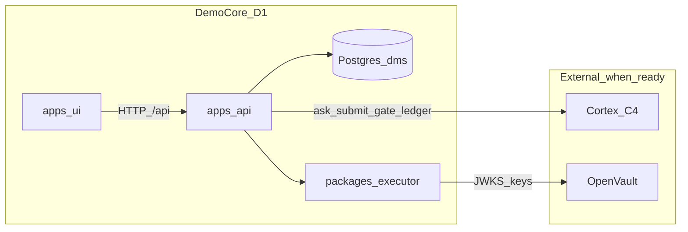

# DMS Demo-Core D1 — plan to personally testable

## Verdict

Full D1 in [DMS_TECHNICAL_ARCHITECTURE.md](DMS_TECHNICAL_ARCHITECTURE.md) §15 still needs Cortex **C4** (submit/pools/F5) plus large DMS slices (T3–T8, T7, T12–T13, U1–U4). That is multi-week. Your ask — *reach a state you can try, demo, and personally stress-test* — locks to **demo-core D1**: one working install with you in the room ([DMS_PRICING_AND_TIMELINE.md](DMS_PRICING_AND_TIMELINE.md) §1.4), not sellable readiness (no C10 / T14 / full hardening).

**Chosen target:** end-to-end clickable product over real DMS HTTP + Postgres, with an explicit **demo ask path** until Cortex C4 lands, then flip to live `/v1/contract/ask` + `submit` without rewriting the UI.

## Acceptance — you can personally stress-test when

1. `deploy/compose` starts Postgres + API; UI on Vite (or static behind Caddy later); `alembic upgrade head` runs on boot or via script.
2. Create/switch Space; scope chip reflects membership ∩ source ACLs ([docs/SPACES.md](docs/SPACES.md)).
3. Chat asks hit DMS API (not only client fixtures); answer shows badge + docked sources; numbers open preview.
4. Studio upload of a small Excel/CSV yields an **honest receipt** (counts + quarantine reasons) and bronze rows carrying `_src` / `_ingest_id` ([architecture §4](DMS_TECHNICAL_ARCHITECTURE.md)).
5. Amend: propose → revise kills old token → confirm under advisory lock (extend existing [proposals.py](packages/core/dms_core/control_plane/proposals.py)); Audit lists `ledger_ref` pointers (append via Cortex when up, else queued/demo).
6. Design stays the locked appliance look in [index.css](apps/ui/src/index.css) (paper / navy / teal / Figtree+Fraunces) — polish only, no theme rewrite.
7. Walk [docs/SPACES.md](docs/SPACES.md) harder scenarios that fit demo data (scope leak attempt, amend revise, concurrent confirm); defer 3 GB / SKU-across-sheets until T7+T12 deepen.

**Explicitly deferred (not this sprint):** T9–T11, T12 full promote, T14 signed receipts, C10, production OIDC, MinIO, sellable hardening.

## Hard dependency (parallel, not DMS-owned)

Cortex **C4** remains the live-answer unblock (submit seam, pools, telemetry, DuckDB bypasses). Until then:

- Wire [gate.py](packages/cortex_client/cortex_client/gate.py) to a real Cortex F5 call when the contract exposes it; keep fail-closed if Cortex is down.
- Chat route: `DMS_ASK_MODE=demo|live` (env). Demo returns server-side scenario envelopes (same shape as live `Answer`) so UI stress-tests HTTP/SSE; badges must not claim certified green for demo rows.
- When C4 is ready: mint manifest via existing [manifest.py](packages/executor/dms_executor/manifest.py) (`cortex-contract==1.1.0` / `canonical_manifest_bytes`), `submit`, then `ask` — regenerate client from `contract/openapi-1.1.0.json` only (never 1.0.0).

## Ops first (before / beside code)

- Create empty GitHub repo **Netie-AI/DMS** (org correction), then:
  `git remote add origin https://github.com/Netie-AI/DMS.git`
- Fix local `safe.directory` for `D:/DMS` if git still refuses (ownership on this FS) — do **not** change global git config unless you approve; prefer `git -c safe.directory=D:/DMS …` or a documented one-liner you run.
- Cortex/OpenVault remotes already pushed; DMS worktrees you were told about stay until you diff/remove.

## Build sequence (DMS)

### Phase 0 — Runtime plumbing (unblocks everything)

- Settings: use `DATABASE_URL`, Cortex/OpenVault URLs in [settings.py](apps/api/dms_api/settings.py); inject `CortexClient` on app lifespan.
- Startup: migrate (`alembic upgrade head`), health reports contract **1.1.0** (today wrongly 1.0.0), dependency reachability.
- Compose: keep Postgres+API; document host Cortex `:8010` / OpenVault `:5000`; add migrate entrypoint; later T6 add UI+Caddy as only public port ([docker-compose.yml](deploy/compose/docker-compose.yml)).
- Seed a demo tenant + Space + synthetic sources for personal stress-test (no NRIC-shaped PII).

### Phase 1 — T3 Spaces + scoped chat API

- Routes under `apps/api/dms_api/routes/`: spaces CRUD, members, source attach, `POST /v1/chat/ask` (and SSE if already sketched in UI plan).
- Reuse [acl.py](packages/executor/dms_executor/acl.py) for effective paths; every mutation calls `compliance_gate` before side effects.
- Session/GUC via existing [session.py](packages/core/dms_core/control_plane/session.py); T5 lite = header/dev actor until OIDC (flagged demo auth, not fake security claims).

### Phase 2 — T7-at-ingest + T13 receipts (thin)

- Alembic revision: `dms.source_ref` + run tables; bronze writer always attaches `_src[]` + `_ingest_id` (architecture Appendix A).
- Studio API: upload → triage → receipt JSON (`ingested` / `quarantined` + reasons). Excel **read-only**; no openpyxl save / `to_excel`.
- DuckDB only inside [packages/executor](packages/executor) when serving starts; Phase 2 may land Parquet bronze on disk first.

### Phase 3 — T4 amend + Audit APIs

- HTTP over existing proposal versioning / advisory lock; confirm path: gate → apply stub or real row mutate when serving exists → ledger append → store `ledger_ref`.
- Audit list/filter by Space; verify CLI remains [packages/ledger](packages/ledger).

### Phase 4 — U-line (interface) on existing design

Preserve tokens in [apps/ui/src/index.css](apps/ui/src/index.css). Improve within that system: focus states, denser source cards, responsive collapse of Sources rail, self-host Figtree/Fraunces for offline appliance.

| Phase | UI work | Key files |
|-------|---------|-----------|
| U1 finish | value→source mapping, contribution sort, preview tied to API | [AnswerMessage.tsx](apps/ui/src/components/AnswerMessage.tsx), [SourcePanel.tsx](apps/ui/src/components/SourcePanel.tsx), [PreviewGrid.tsx](apps/ui/src/components/PreviewGrid.tsx) |
| U2 | live Space switcher, Library/Data Map page | [AppContext.tsx](apps/ui/src/context/AppContext.tsx), [api.ts](apps/ui/src/lib/api.ts), replace stubs in [StubPages.tsx](apps/ui/src/pages/StubPages.tsx) |
| U3 | Studio drop zone + receipt; Runs timeline | new `StudioPage` / `RunsPage` |
| U4 | Amend diff/confirm/409; Audit verify | new `AmendPage` / `AuditPage` |

Replace client-only fixtures with API clients; keep fixtures only as offline fallback behind a visible “demo data” banner.

### Phase 5 — T6 thin packaging + personal test harness

- Caddyfile fronts UI+API; Cortex/OV not published on host.
- [Start-DMSStack.ps1](scripts/windows/Start-DMSStack.ps1): migrate, seed, print URLs.
- Checklist from SPACES.md scenarios + “API offline banner”, amend stale token, scope chip change mid-session.

## Design / hue

Do **not** retheme. Keep paper `#f3f0ea`, ink `#1a2332`, accent `#0d6b5c`, Fraunces display / Figtree body. Allowed improvements: contrast on badges, source-panel hierarchy, motion limited to panel open / answer reveal (2–3 intentional), tighter empty states on stubs-turned-pages. Reject Inter/neon-green from pre-T0 archive.

## What “done for your stress-test” looks like

You run the stack, open the SPA, switch Spaces, ask questions (demo mode or live if C4 is up), click a number into Sources, upload a file and read a receipt, run an amend revise/confirm, open Audit. That is demo-core D1. Remaining full-queue items (T12 promote, deep T7 drill-through rewrite, T5 OIDC, C10) stay on the roadmap after you have used the app.
