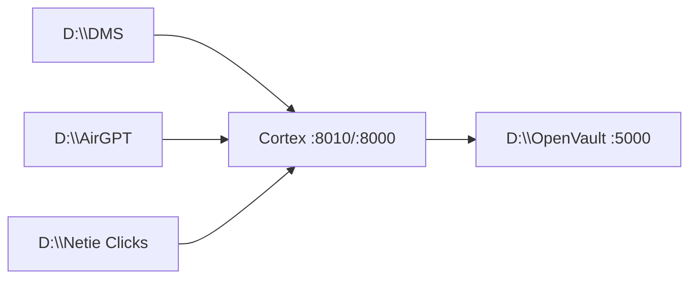

# Cortex — Active map (engine-first, 2026-07-31)

**Read this first for any Cortex session.**  
DMS-only lane: [`docs/dms/ACTIVE.md`](dms/ACTIVE.md).  
Roles contract (keep identical across repos): [`PRODUCT_ROLES.md`](../PRODUCT_ROLES.md).

---

## Identity (do not collapse)

| Layer | Job | Lives at |
|-------|-----|----------|
| **Cortex** | Governed **engine** — MoE/presets, DAG/OSR/seeker, memory, ontology writes, F1/F5/F7 | `D:\Cortex` (`CortexOS/` + `packs/*`) |
| **OpenVault** | Keys SoT + leave-machine gate + **FreeRoute** (budget/route) | `D:\OpenVault` |
| **DMS / Spaces** | Data consumer — ChatGPT-for-Excel+DB; Spaces = ACL sandboxes | Pack `packs/dms/` · product `D:\DMS` |
| **AirGPT** | Thin host shell — phone/settings/apps hub; proxies Cortex | `D:\AirGPT` |
| **Pointer / Netie Clicks** | Act / `computer_control` client | `D:\Netie Clicks` (not `D:\Pointer`) |
| **OpenIDE** | Coding expert slice | Out-of-repo / workflow surface |
| **RUMA / Closer** | Parked vertical (respond.io-class) | `D:\RUMA` · pack `packs/ruma` · plan in `docs/bin/verticals/` |

**Safe path:** App → Cortex (think) → OpenVault (keys + gate) → run → ledger.  
**PR test:** *Does this make the engine better, or is it just another app?* Apps → pack or sibling repo.

---

## Canonical docs (≤6 for day-to-day)

| # | Doc | Role |
|---|-----|------|
| 1 | [`PRODUCT_ROLES.md`](../PRODUCT_ROLES.md) | Who owns brains / keys / shell / Act |
| 2 | [`docs/strategy/CORTEX_FINAL_GOAL.md`](strategy/CORTEX_FINAL_GOAL.md) | Engine north star |
| 2b | [`docs/strategy/NETIE_ENGINE_DEPTH_PLAN_2026-07-31.md`](strategy/NETIE_ENGINE_DEPTH_PLAN_2026-07-31.md) | **Depth plan** — ontology/AIP foundation, Distill/KB, loops, Act, horizons H0–H6 |
| 3 | [`docs/strategy/CORTEX_WHITEPAPER.md`](strategy/CORTEX_WHITEPAPER.md) | Ecosystem + architecture thesis |
| 4 | [`docs/engine/CONSUMERS.md`](engine/CONSUMERS.md) | Sibling apps + how they talk to Cortex |
| 5 | [`STATUS.md`](../STATUS.md) + [`PARKING_LOT.md`](../PARKING_LOT.md) | Live truth / deferred |
| 6 | [`docs/dms/packets/NEXT_LANES.md`](dms/packets/NEXT_LANES.md) | Cross-lane continue prompts |

**Lane deep-dives (only when that lane is active):**
- DMS/Spaces → [`docs/dms/ACTIVE.md`](dms/ACTIVE.md)
- Sandbox honesty → [`docs/dms/SANDBOX_ORIENTATION.md`](dms/SANDBOX_ORIENTATION.md)
- Sibling inventory → [`docs/bin/subagent-results/2026-07-31_sibling-repos-inventory.md`](bin/subagent-results/2026-07-31_sibling-repos-inventory.md)

---

## Repo policy — do **not** open a second engine repo

| Keep | Split already done | Do not do |
|------|--------------------|-----------|
| `D:\Cortex` = **one** engine + packs monorepo | Product chrome in `D:\DMS`, `D:\AirGPT`, `D:\Netie Clicks`, `D:\OpenVault` | Big-bang merge of every app into Cortex |
| `cortex-contract` pin + HTTP — consumers never import `CortexOS` | Packs (`dms`, `crm`, `ruma`) register into engine | Second orchestrator inside AirGPT |
| Land capabilities one gate at a time (P15) | FreeRoute **inside** OpenVault (no `D:\FreeRoute`) | Clone Cortex into “DMS-engine” + “Pointer-engine” |

**Why not two Cortex repos?** Contract drift, double CI, split ledger/governance, and the whitepaper already rejected “Brain B as a forever fork.” Sibling **apps** yes; sibling **engines** no.

---

## Engine capabilities that serve *all* apps (keep alive)

These are **not** “DMS-only” and must not be thrown away as product ideas:

| Capability | Status | Serves |
|------------|--------|--------|
| Seek / OSR / routines / commitments (G2) | Shipped slices | AirGPT UI, Pointer plan bands, any bound goal |
| `computer_control` + Act | Shipped for Pointer | `D:\Netie Clicks` |
| Ontology `call_action` / Agent SDK | Shipped | Every consumer |
| Memory / RAG / context engineering | Partial → roadmap | All |
| Persistent / long-horizon agent (JEPA family, MemPalace/Mem0) | **Scaffold / research** — **not shipped**; honesty: do not claim trained | Future engine memory durability |
| Palantir-style ontology depth (P1) | Patterns in O1–O7; full parity **parked** | Consumers when paying |
| respond.io / Closer (P4/P9) | **Parked vertical** | RUMA pack — not engine core |

**Honesty rule:** “Not in DMS Spaces demo” ≠ “delete from Cortex roadmap.”  
THROW_AWAY meant: *do not claim shipped / do not mix into wrong demo / do not build before conditions* — not *erase the idea*.

---

## Work queues (by lane)

| Lane | Queue pointer |
|------|----------------|
| DMS / Spaces / eval | [`docs/dms/ACTIVE.md`](dms/ACTIVE.md) — **demo clear done**; next W7 C7 schema-gate + W1 Postgres |
| Engine adoption (P17) / OpenVault (P17a→G2.6) | `PARKING_LOT` P17 · after DMS demo week |
| Pointer Act | STATUS Pointer blocks · live in `D:\Netie Clicks` |
| AirGPT thin shell | Keep proxies only — no second vault/orchestrator |
| Multi-app critique | [`…_multi-app-engine-critique.md`](bin/subagent-results/2026-07-31_multi-app-engine-critique.md) |

**Engine spine:** DMS floor first — [`docs/dms/DMS_ANCHORED_SEQUENCE.md`](dms/DMS_ANCHORED_SEQUENCE.md).  
H-depth ([`NETIE_ENGINE_DEPTH_PLAN`](strategy/NETIE_ENGINE_DEPTH_PLAN_2026-07-31.md)) is **upcoming** after C7-prod + claim_n + Postgres→Amend→Spaces; pull ontology/Act slices earlier only when they improve DMS. Ontology/agentic/Click stay Cortex capabilities that serve DMS + Clicks + AirGPT — not a fork away from the product.

---

## Bin vs restore

| Stay in `docs/bin/` | Do not restore as active build |
|---------------------|--------------------------------|
| PASS F-gate packets, shipped G2 handoffs | Historical proof only |
| RUMA Activepieces plan | Until P4/P9 un-park |
| Fable5 O-series prompts | O1–O7 largely done |
| One-off DMS pricing/plan drafts | — |

| Never “binned” as concepts | Clarification |
|----------------------------|---------------|
| Pointer / Act | Out of **DMS demo**; first-class **engine consumer** |
| JEPA / MemPalace / Mem0 | Not **shipped**; still **engine memory roadmap** |
| Palantir parity / Closer | **Parked** with conditions — not discarded forever |
