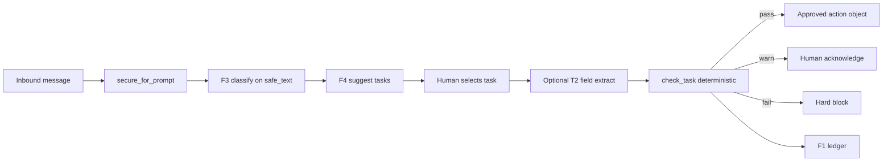

# F5 — Compliance Gate on Suggested Tasks
**Status:** APPROVED by Claude supervisor (2026-06-26) — ready to dispatch  
**Branch:** `dms-v2` | **Baseline:** 134 passed, 4 skipped  
**Spec source:** [BUILD_PLAN.md](BUILD_PLAN.md) §FEATURE 5

---

## Supervisor constraints (non-negotiable)

1. **Phase 1 is mandatory, test-first.** Write `test_pii_redacted_before_classify` FIRST so it **fails** on raw PII reaching the intent matcher. Then fix `classify()`. Not optional even if other tests pass.

2. **Value threshold:** YAML rule uses `severity: warning` + `require_key: human_acknowledged`. Numeric MYR threshold applied in **Python post-rule** in `gate.py` only. Do **not** add numeric comparison to `ComplianceEngine` YAML.

3. **`test_verdict_deterministic`:** Must loop **100×** in a single test (`for _ in range(100):`), not two calls.

4. **`api.js` restore:** Functions must match `task_routes.py` paths exactly — do not invent endpoints.

---

## Architecture



---

## Execute in this order (do not reorder)

### Phase 0 — Doc sync (Gate F4 closed)

| File | Change |
|---|---|
| `STATUS.md` | Gate F4 PASS; active = F5 in progress; tests 134/4 |
| `CONTEXT.md` | F4 in gates list |
| `CLAUDE_HANDOFF.md` | Gate pending = **F5** (use template at bottom after build) |
| `CURSOR_HANDOFF.md` | Active feature = F5 |
| `CHANGELOG_DMS.md` | Gate F4 PASS note (F5 section appended after build) |

Run `python scripts/handoff.py --write`.

---

### Phase 1 — PII-before-classify (Gate F4 gap fix)

**File:** `packs/dms/classify/intent.py`

1. Write `tests/dms/test_gate.py::test_pii_redacted_before_classify` **first** — spy on intent matcher input; assert `900101-14-5678` never reaches matcher; test must fail before fix.
2. Refactor `classify(text)`:
   - Always run `secure_for_prompt()` first on **all** paths (heuristic AND model).
   - Pass `harness.safe_text` to `classify_with_model()` and heuristic path.
   - Blocked harness → return blocked `ClassifyResult` immediately.
3. Add PII case to `tests/dms/test_f3_classify.py`.

---

### Phase 2a — Rules YAML

**New:** `packs/dms/compliance/dms_rules_v1.yaml`

Use **existing engine keys only** (`when_doc_type`, `when_matches`, `unless_matches`, `require_key`, `severity`). No engine fork.

```yaml
rules:
  - id: quote_total_present
    when_doc_type: dms_task
    when_matches: { task_action: send_quote }
    require_key: quote_total_myr
    severity: error

  - id: pickup_address_required
    when_doc_type: dms_task
    when_matches: { task_action: schedule_pickup }
    require_key: pickup_address
    severity: error

  - id: no_outbound_unverified
    when_doc_type: dms_task
    when_matches: { task_action: send_outbound }
    unless_matches: { customer_verified: true }
    require_key: customer_verified
    severity: error

  - id: value_threshold_requires_human
    when_doc_type: dms_task
    require_key: human_acknowledged
    severity: warning
    description: "High-value task requires steward acknowledgement"
```

---

### Phase 2b — Gate module

**New:** `packs/dms/tasks/gate.py`

```python
@dataclass
class ComplianceVerdict:
    status: Literal["pass", "warn", "fail"]
    violations: list[dict]
    executable: bool
```

`check_task(event_id, task_id, filled_template)`:
1. PII-redact string fields via `redact_for_prompt()`
2. `ComplianceEngine.from_ruleset("packs/dms/compliance/dms_rules_v1.yaml").evaluate("dms_task", extracted)`
3. **Python post-rule:** if `value_myr > DMS_VALUE_THRESHOLD_MYR` (default 5000) and not `human_acknowledged` → add warning violation
4. Map: any `error` → `fail`; any `warning` → `warn`; else `pass`
5. `executable=True` only on pass, or warn + `human_acknowledged`
6. Persist `dms_task_events.gate_status`; ledger `task.gate_passed` / `task.gate_warned` / `task.gate_failed`

**New (minimal):** `packs/dms/tasks/extract.py` — T2 field extract only; LLM never decides verdict.

---

### Phase 2c — Migration

**New:** `packs/dms/sql/005_task_events_v0.sql`

Table: `dms_task_events(id, message_id, thread_id, task_id, intent, filled_template, gate_status, violations, executable, human_acknowledged, created_at)`

Init in `gate.py` (SQLite demo pattern from `packs/dms/chat/threads.py`).

---

### Phase 3 — API routes (source of truth for api.js)

**New:** `CortexOS/api/task_routes.py` (no `from __future__ import annotations`; Pydantic at module level)

| Method | Path | Body | Response |
|---|---|---|---|
| POST | `/dms/tasks/gate/check` | `{event_id, task_id, filled_template}` | `ComplianceVerdict` |
| POST | `/dms/tasks/choose` | `{message_id, thread_id, task_id, filled_template, actor}` | `{event_id, verdict, ok}` |
| POST | `/dms/tasks/gate/acknowledge` | `{event_id, actor}` | `{verdict, ok}` |

Register via `register_task_routes(app)` in `CortexOS/api/app.py` (DMS block).

**Extend** `CortexOS/api/brain_routes.py` `task_choice`: when `filled_template` provided → `check_task` → return `{ok, verdict}`.

---

### Phase 4a — Restore `demo/dms-ui/lib/api.js`

File is imported but missing. Restore existing helpers used by other pages:

- `checkHealth`, `fetchTables`, `fetchTablePreview`, `postQuery`, `fetchAudit`, `proposeEdits`
- Warehouse helpers used by `warehouse/page.jsx`
- Chat: `createChatThread`, `fetchThreadMessages`, `sendThreadMessage`

**New functions — paths must match Phase 3 exactly:**

```javascript
// POST /dms/tasks/gate/check
export async function checkTaskGate({ eventId, taskId, filledTemplate }) { ... }

// POST /dms/tasks/choose
export async function chooseTask({ messageId, threadId, taskId, filledTemplate, actor }) { ... }

// POST /dms/tasks/gate/acknowledge
export async function acknowledgeGate({ eventId, actor }) { ... }

// POST /dms/brain/suggest (existing brain route)
export async function fetchTaskSuggestions({ useLlm = false } = {}) { ... }
```

---

### Phase 4b — Chat UI verdict banner

**Update:** `demo/dms-ui/app/chat/page.jsx`

- After inbound message (API returns `classification`), show task suggestion chips
- On chip click → `chooseTask()` → verdict banner:
  - **Green (pass):** ready for steward execution
  - **Amber (warn):** violations + "Acknowledge & proceed" → `acknowledgeGate()`
  - **Red (fail):** hard block + violation list

---

### Phase 4c — Brain UI gate inline

**Update:** `demo/dms-ui/app/brain/page.jsx`

- `handleAccept` → gate before accept; show verdict in `SuggestionsCard`

---

### Phase 5 — Tests

**New:** `tests/dms/test_gate.py`

| Test | Requirement |
|---|---|
| `test_missing_field_blocks` | Missing `quote_total_myr` on send_quote → fail, not executable |
| `test_pass_marks_executable` | Complete template → pass + ledger `task.gate_passed` |
| `test_value_threshold_requires_human` | `value_myr=10000` no ack → warn; with ack → pass |
| `test_verdict_deterministic` | **100× loop** — identical status every run |
| `test_llm_never_decides_verdict` | Mock extractor with random pass/fail flag; verdict unchanged |
| `test_pii_redacted_before_classify` | NRIC not in text reaching intent matcher |

**Full suite:** `pytest -q` → 134+ passed, same 4 skipped.

---

## Anti-scope (hard stops)

- Do NOT rewrite `CortexOS/compliance/engine.py`
- Do NOT execute warehouse mutations or send customer messages
- Do NOT touch F1/F6/F7 internals beyond `append()` and `redact_for_prompt()`
- Do NOT start F6 or Phase 0 docker deploy
- Do NOT weaken any of the 134 existing tests

---

## File manifest

| Action | Path |
|---|---|
| NEW | `docs/dms/F5_PLAN.md` (this file) |
| NEW | `packs/dms/compliance/dms_rules_v1.yaml` |
| NEW | `packs/dms/compliance/__init__.py` |
| NEW | `packs/dms/tasks/gate.py` |
| NEW | `packs/dms/tasks/extract.py` |
| NEW | `packs/dms/sql/005_task_events_v0.sql` |
| NEW | `CortexOS/api/task_routes.py` |
| NEW | `tests/dms/test_gate.py` |
| NEW | `docs/dms/GATE_F5_PACKET.md` |
| NEW | `demo/dms-ui/lib/api.js` |
| MODIFY | `packs/dms/classify/intent.py` |
| MODIFY | `packs/dms/tasks/suggest.py` |
| MODIFY | `CortexOS/api/app.py`, `brain_routes.py` |
| MODIFY | `demo/dms-ui/app/chat/page.jsx`, `brain/page.jsx` |
| MODIFY | `STATUS.md`, `CONTEXT.md`, `CLAUDE_HANDOFF.md`, `CURSOR_HANDOFF.md`, `CHANGELOG_DMS.md` |

---

## Verification sequence (run in order)

```powershell
pytest tests/dms/test_gate.py -q
pytest tests/dms/test_f3_classify.py -q
pytest -q
.\scripts\verify_all.ps1
python scripts/handoff.py --write
```

Manual: inbound PII message → task select → green/amber/red verdict in UI.

---

## After build — commit and gate

```powershell
git add -A
git commit -m "F5: compliance gate, PII-before-classify fix, task events"
git push origin dms-v2
```

Paste updated `CLAUDE_HANDOFF.md` to Claude for **Gate F5**. Do NOT start F6 until Gate F5 PASS.

---

## CLAUDE_HANDOFF template (apply after F5 build completes)

Replace gate-pending section in `CLAUDE_HANDOFF.md`:

```markdown
## Current gate
| Field | Value |
|---|---|
| Last gates PASS | V0, V1, F1-hardened, F7, F2, F3-security, F4 |
| Gate pending | **F5** — compliance gate on tasks |
| Next build after PASS | **F6** skill capture (consented, opt-in) |

## Gate F5 checklist (verify now)
- [ ] test_missing_field_blocks — missing quote_total_myr → fail, not executable
- [ ] test_pass_marks_executable — complete template → pass + ledger task.gate_passed
- [ ] test_value_threshold_requires_human — value_myr=10000 no ack → warn; with ack → pass
- [ ] test_verdict_deterministic — same input 100× loop → identical status every run
- [ ] test_llm_never_decides_verdict — mocked extractor random output; verdict unaffected
- [ ] test_pii_redacted_before_classify — NRIC not present in text reaching intent matcher
- [ ] pytest -q → 134+ passed, same 4 skipped
- [ ] verify_all.ps1 green
- [ ] Manual: inbound PII message → task select → green/amber/red verdict in UI

## Anti-scope reminder
No ontology, no auto-commit, no PII in prompts, no engine rewrite,
no parallel feature builds, no F6 until Gate F5 PASS.
```

---

## Cursor dispatch prompt

```
Use dms-subagent-dispatch to ship F5 per docs/dms/F5_PLAN.md
(approved by Claude supervisor 2026-06-26).

Branch: dms-v2. Baseline: 134 passed, 4 skipped.
Rules: cortex-core.mdc + cortex-dms-backend.mdc + cortex-dms-frontend.mdc
       + cortex-security.mdc

PLANNING MODE FIRST. Confirm the exact file manifest from F5_PLAN.md before
writing any code. List every file you will create or modify.

Execute phases 0→5 in order — do not reorder. See F5_PLAN.md for full spec.

Do NOT start F6 until Gate F5 clears with Claude supervisor.
Bring CLAUDE_HANDOFF.md to Claude for Gate F5.
```
