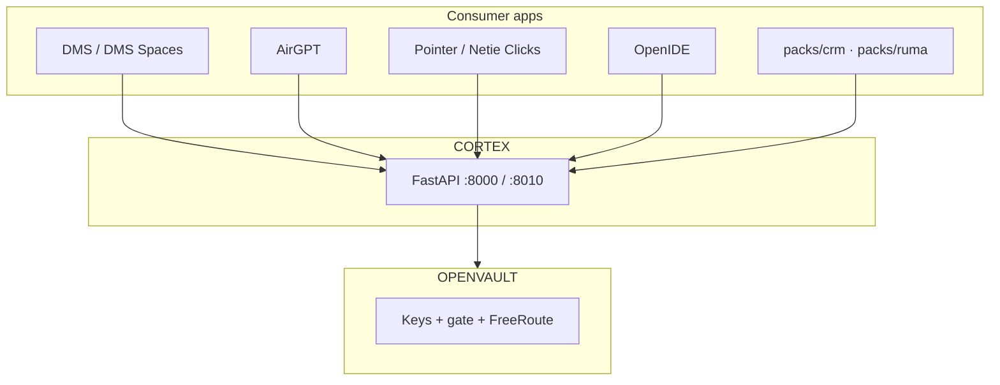

# Multi-App Engine Critique — Cortex Ecosystem (2026-07-31)

**Agent:** file-search / ecosystem analysis  
**Sources read:** `CORTEX_WHITEPAPER.md`, `CORTEX_FINAL_GOAL.md`, `DMS_SPACES_PRODUCT_2026-07-29.md`, `ACTIVE.md`, `SANDBOX_ORIENTATION.md`, `PARKING_LOT.md` (P1/P4/P9/P12/P14/P17/P19/P21), `STATUS.md`, `ARCHITECTURE.md`, `PRODUCT_ROLES.md`, `2026-07-31_active-work-queue.md`, codebase search (AirGPT, Pointer, OpenVault, RUMA, MemPalace, JEPA, Act, FreeRoute, seek, persistent agent).

---

## Executive summary

Cortex’s **correct identity** is a **governed agentic engine** (orchestration + engine capability + shared governance spine), not a vertical product monorepo. The `D:\Cortex` git tree is **engine + reference packs** (`packs/dms`, `packs/crm`, `packs/ruma`); **product UIs and sibling apps live in separate paths/repos** and talk to Cortex over HTTP, sidecar routes, and `cortex-contract`.

The 2026-07-31 doc hygiene (`ACTIVE.md`, work queue, `docs/bin/`) correctly **de-scoped DMS Spaces** as one consumer and **binned demo-scope confusion** (Pointer inside DMS demo, amend-before-Postgres, MemPalace-as-shipped). It is **too DMS-centric** as the *engine* onboarding map: AirGPT, Pointer, OpenVault, and pack-scaffold consumers are absent from the ≤6 canonical refs and from W1–W12, even though the whitepaper and `PRODUCT_ROLES.md` already define them.

**Repo policy (already decided):** monorepo for engine + packs; spin-off sibling products (`D:\DMS`, `D:\AirGPT`, `D:\OpenVault`, `D:\Netie Clicks`) — not a full split into N repos for every app.

---

## 1. Cortex’s correct identity

### Engine layer (what Cortex **is**)

From `CORTEX_FINAL_GOAL.md` and `CORTEX_WHITEPAPER.md`:

| Cortex **is** | Evidence |
|---|---|
| Orchestration brain — DAG, presets (`minimal` / `dag` / `rag` / `memory` / `computer_control`), gen-cFSM, OSR, seeker, routines | Whitepaper §3; `CortexOS/execution/` |
| Engine capability — memory, hybrid RAG, context engineering, lakehouse hooks, semantic/answer paths | Whitepaper §3.2; `CortexOS/memory/`, `context_engineering/` |
| Shared governance spine — F1 ledger, F5 compliance, F7 RBAC; **actions as the only write path** | `CORTEX_FINAL_GOAL.md`; `PRODUCT_ROLES.md` |
| Product surface for external builders — **hosted API (P17)** + **downloadable “netie engine” (P17)** | `PARKING_LOT.md` P17; whitepaper §6.1 |
| Ontology-as-memory + LLM-as-reasoner thesis | Whitepaper §1; `ENGINE_SDK_DUAL_BRAIN_PLAN` |

**North-star PR test** (repeated in whitepaper, final goal, dual-brain plan):

> *Does this make the engine better, or is it just another app on top?*  
> If the latter → consumer pack or sibling repo, not `CortexOS/`.

### What Cortex is **not**

| Not Cortex | Where it lives |
|---|---|
| Vertical warehouse SaaS / ChatGPT-for-Excel **product chrome** | `D:\DMS` (product home); `demo/dms-ui/` (engine smoke) |
| Key vault, leave-machine gate, FreeRoute spend router | `D:\OpenVault` (sibling product) |
| Phone/settings/apps hub UI | `D:\AirGPT` (`:8765`; mirror may exist under `CortexOS/AirGPT/`) |
| Computer-control click loop | `D:\Netie Clicks` (Pointer) |
| Coding workspace / deploy console | OpenIDE (out-of-repo) |

### Monorepo vs “product monorepo”

`D:\Cortex` is **not** a single product monorepo for all Netie apps. It is:

```
Cortex/     ← engine SoT + reference packs + bench/tests/contract
├── CortexOS/          # Engine runtime (must never import packs.*)
├── packs/dms|crm|ruma/   # Reference consumers registering into engine ports
├── packages/cortex_contract/  # Wire models (DMS pins this)
└── demo/dms-ui/       # Legacy/smoke UI — product → D:\DMS
```

**Sibling products (SoT outside this tree):** whitepaper §5, `PRODUCT_ROLES.md`, `PARKING_LOT.md` P17a.

Hard invariant (`.cursorrules`, `CLAUDE.md`): `CortexOS/**` must not import `packs.*`; packs register **into** the engine.

---

## 2. Consumer apps — inventory, location, Cortex integration

### Ecosystem diagram (canonical)

From `CORTEX_WHITEPAPER.md` §2:



**Safe path:** App → Cortex (think) → OpenVault (keys + may this leave?) → run/deploy → ledger.

### App-by-app table

| App / surface | Role | Location (path / folder) | How it talks to Cortex |
|---|---|---|---|
| **DMS** | Reference + primary product consumer — warehouse ops, NL→SQL, amend, Spaces ACL | Pack: `D:\Cortex\packs\dms\` · Product UI/API: `D:\DMS` · Smoke UI: `D:\Cortex\demo\dms-ui\` | `POST /dms/query`, pack plug-in routes, `cortex-contract` (`POST /v1/chat/ask` from DMS), Agent SDK via `packs/dms/agents/sdk.py`, sidecar `/dms/sidecar/*` |
| **DMS Spaces** | Product mode on DMS — named sandboxes over selected sources (data-plane ACL ∩) | Spec: `docs/strategy/DMS_SPACES_PRODUCT_2026-07-29.md` · implementation spans DMS + engine lake/query | Same as DMS; Spaces scope enforced in storage/query layer, not a separate app |
| **AirGPT** | Thin host shell — phone, settings, pairing, **apps hub**; proxies Seek/Routines/Apps | `D:\AirGPT` (STATUS: `b0723db`); optional mirror `CortexOS/AirGPT/` (gitignored runtime) · **:8765** reserved | `cortex_client.py` → `:8010` engine; sidecar `/dms/secure\|classify\|audit`; O5 `/dms/sidecar/query-objects\|call-action`; proxies `/api/cortex/*`, `/api/engine/*`, `/api/goals/*`, `/api/routines/*`, `/api/apps/*`; OpenVault bridge `/api/openvault/*` |
| **Pointer / Netie Clicks** | External **Act** client — `computer_control` preset | `D:\Netie Clicks` (`netie-pointer`); **out of DMS Spaces demo** per product lock | Cortex `:8010` Act fail-closed; requires `PACK=dms` + live `/dms/secure` (distill capture `2026-07-29_pointer-demo`); OpenVault for vision on Ask path |
| **OpenIDE** | Coding expert slice — TSX/canvas, tools, FS, PRs | Out-of-repo; context mirror noted in STATUS | Asks Cortex for brain/tools; **not** deploy console (`PRODUCT_ROLES.md`) |
| **OpenVault** | Custody + ship — keys SoT, leave-machine gate, **FreeRoute** (OmniRoute-class budget/route) | `D:\OpenVault` separate repo · **:5000** | Cortex **asks** via `integrations/openvault_client.py`, `openvault_gate.py`, `workflow_openvault.py`; AirGPT thin-client only |
| **packs/crm** | Scaffold reference consumer (Account/Contact/Opportunity) | `D:\Cortex\packs\crm\` | O7 `scripts/new_pack.py` pattern; `CortexOS.agent_sdk` + ontology YAML |
| **packs/ruma** | Parked vertical — real-estate agents (buyer/seller/closer/compliance) | `D:\Cortex\packs\ruma\` · plan binned: `docs/bin/verticals/RUMA_PHASE3_5.md` | Would use `/chat` + A2A personas (`CortexOS/a2a/personas/`); Activepieces/`activeflow/` **unwired** |
| **Imported apps** | User/ FDE “bring a folder/zip” apps | `data/apps/installed/` (runtime); engine `app_store.py` | `/api/apps/*`, dockerize, 88xx ports (8765 = AirGPT reserved); OpenVault hosting lane for public deploy |

### Ports (local stack)

| Port | Owner | Source |
|---:|---|---|
| 8000 | Cortex API (pack=`dms` demo) | Whitepaper §3.3 |
| 8010 | Cortex engine surface (routines / seek / OSR / **Act**) | Whitepaper §3.3; STATUS Pointer block |
| 3000 | `demo/dms-ui` smoke | Whitepaper §3.3 |
| 5000 | OpenVault | Whitepaper §3.3 |
| 8765 | AirGPT API | Whitepaper §3.3 |

### Engine ingress paths (multi-app)

From whitepaper §3.1 — all consumers converge on the same governed loop:

1. Chat / `/dms/query` (DMS)
2. Webhook `/fire` (open-set)
3. Seek tick / routine schedule (proactive — G2.1+)
4. **Act from Pointer** (`computer_control`)
5. Sidecar classify/secure (AirGPT pre-LLM gate)

### Benchmark coverage

`bench/usecases.py` exercises **five surfaces** deterministically: DMS, AirGPT, AgenticCreator (race/gen-cFSM/apps), Scheduler (routines/governor), OpenIDE (workflows). **Pointer is not in this bench** — gap for multi-app regression.

---

## 3. THROW_AWAY items — what was wrong to bin for a **multi-app engine**

The work queue (`2026-07-31_active-work-queue.md` § THROW_AWAY) mixes **(A) demo-scope corrections**, **(B) honesty corrections**, and **(C) strategic deferrals**. For a multi-app engine, only some binning is “wrong.”

| THROW_AWAY item | Verdict for multi-app engine | Reasoning |
|---|---|---|
| **Pointer / Netie Clicks in DMS demo** | ✅ **Correct to bin** (demo scope) · ⚠️ **Wrong to treat Pointer as discardable** | `DMS_SPACES_PRODUCT` §1: “Pointer is external”; “out of this demo.” Pointer remains a **first-class engine consumer** (`computer_control`, Act on `:8010`). STATUS 2026-07-29 documents shipped Act fail-closed work. Bin means: don’t merge Pointer UX into DMS Spaces — not “stop building Pointer.” |
| **respond.io / Closer (P4/P9)** | ✅ **Correct to park** | Different vertical (`packs/ruma`, RUMA plan in `docs/bin/verticals/`). Condition: paying DMS partner or explicit RUMA priority. For multi-app engine: valid **future pack consumer**, not engine core. `activeflow/` clone correctly marked unwired/deletable. |
| **Palantir ontology + AIP full parity (P1)** | ✅ **Correct to park** | P1 condition: paying clients + F1–F7 hardened. Engine-first: ontology **patterns** land in engine (O1–O7 shipped); full AIP parity is **per-consumer** FDE work (`P14`, `new_pack.py`). Not wrong for multi-app — just not engine milestone. |
| **Amend-before-Postgres** | ✅ **Correct to supersede** | DMS **product** build order lock: Phase 0 Postgres+RLS → Phase 1 Amend (`DMS_SPACES_PRODUCT` §7). Irrelevant to AirGPT/Pointer; correct DMS-only correction. |
| **MemPalace / Mem0 / trained JEPA as *shipped*** | ✅ **Correct to bin as claims** · ⚠️ **Wrong to bin as roadmap** | Honesty: JEPA **family gate** + shrinkage `action_value` exist; **trained world-model JEPA does not** (STATUS G2.2, whitepaper §8). MemPalace/Mem0 are ranked P3 research (`G1_GEN_CFSM_JEPA.md`); P21 still names JEPA-rank in enterprise loop. Bin the **marketing lie**, not the research track. |
| Big-bang `netie-engine` merge | ✅ Correct | P15 / dual-brain Option B via C |
| WASM/Firecracker production | ✅ Correct (P2) | Host `tool_runner` is current F8 path (`SANDBOX_ORIENTATION.md`) |
| Third orchestrator / Temporal | ✅ Correct | Blessed stack: `dag_runner` + race_router |
| STATUS “Next: G2.3” | ✅ Correct (stale) | G2.3–G2.5 shipped 2026-07-27 |

### Items that look “binned” but are **engine-relevant** (should stay visible outside DMS lanes)

| Topic | Where it belongs |
|---|---|
| Pointer Act + `PACK=dms` + `/dms/secure` | Engine consumer contract doc + `bench/` case |
| G2 seek/OSR/telemetry (shipped) | `docs/engine/` — AirGPT proxies this today |
| P17 / P17a hosted + self-host + OpenVault gate | Engine adoption spine (W12, W10) |
| `computer_control` preset | `architecture_presets.py` — Pointer’s ingress |
| Multi-pack scaffold (`packs/crm`, O7) | Engine SDK story, not DMS |

---

## 4. Repo split vs monorepo + spin-offs

### What docs already decided

| Decision | Source | Status |
|---|---|---|
| **Option B via C** — land engine capabilities one gate at a time; no big-bang `netie-engine` → `main` | `ENGINE_SDK_DUAL_BRAIN_PLAN` §2 (owner 2026-07-23); `PARKING_LOT` P15 | ✅ Settled |
| **Brain B (engine) is the product**; Brain A (DMS) is first reference consumer | `CORTEX_FINAL_GOAL.md`; dual-brain plan §0 | ✅ Settled |
| **DMS product UI spins to `D:\DMS`** | Whitepaper §5; `ACTIVE.md` | In progress |
| **OpenVault is sibling repo `D:\OpenVault`** | P17a; whitepaper §5 | Settled |
| **AirGPT separate install `D:\AirGPT`** | STATUS 2026-07-23; whitepaper §5 | Settled (mirror in tree) |
| **Pointer external `D:\Netie Clicks`** | Whitepaper §5; distill capture | Settled |
| **New verticals via `packs/<name>/` + O7**, not new engine forks | O7 shipped; `packs/crm` demo | Settled |

### Options analysis

| Model | Pros | Cons | Evidence |
|---|---|---|---|
| **Keep monorepo + spin-offs** (current) | Single CI for engine+packs; `cortex-contract` co-evolves; `lint-imports` enforces boundaries; FDE scaffolds packs in-tree | `ACTIVE.md` drifts DMS-heavy; sibling repos can version-skew; AirGPT mirror/gitignore confusion | Whitepaper §5; CLAUDE.md import rules; O7 `new_pack.py` |
| **Split engine-only repo** | Cleaner external narrative (P17/P18) | DMS reference pack must publish separately; contract coordination harder; breaks current bench/tests layout | P18 asks for adoptable engine docs — doesn’t require split |
| **Split every app to own repo** | Clear product ownership | Already happening for DMS/AirGPT/OV/Pointer; **packs stay with engine** per O-series | `D:\DMS`, `D:\AirGPT`, etc. |
| **Full product monorepo** | — | **Rejected** by final goal + whitepaper: apps are consumers, not engine | CORTEX_FINAL_GOAL “is not a vertical product” |

**Recommendation (aligned with existing decisions):**  
**Keep `D:\Cortex` as engine + packs monorepo.** Continue **spin-offs for product chrome** (DMS, AirGPT, OpenVault, Pointer). Do **not** split `packs/dms` out until DMS repo consumes engine exclusively via HTTP + pinned `cortex-contract` (already the direction in `DMS_TECHNICAL_ARCHITECTURE.md`).

---

## 5. Proposed doc structure vs current DMS-heavy `ACTIVE.md`

### Critique: `docs/dms/ACTIVE.md`

| Issue | Detail |
|---|---|
| **Title frames DMS as co-equal** | “DMS + Netie — Active map” — engine is one row in orientation table; work queue is 12/12 DMS/Spaces tracks |
| **Canonical six** | 4/6 refs are DMS packets/plans; engine whitepaper demoted to “onboarding only” |
| **Missing consumers** | No AirGPT, Pointer, OpenVault, `packs/crm`, or P17 adoption path in active map |
| **Good** | Correctly states Cortex vs DMS vs Pointer; points to work queue; bin rule for `docs/bin/` |

### Critique: `docs/dms/SANDBOX_ORIENTATION.md`

| Issue | Detail |
|---|---|
| **DMS-path canonical pointer** | Says “also summarized in ACTIVE.md” — all sandbox vocabulary is routed through DMS docs |
| **Three “sandbox” meanings** | Host-shim (F8), Docker (apps/deploy), Spaces (ACL) — well disambiguated |
| **Missing fourth meaning** | **`computer_control` / Act** (Pointer) — a distinct execution sandbox path on `:8010`; not mentioned |
| **Good** | Honest WASM=P2; RUMA/Activepieces binned; rule before tool #2 |

### Proposed layout

```
docs/
├── ACTIVE.md                          # NEW root — 6 refs max, engine-first
├── engine/
│   ├── ACTIVE.md                      # Engine day-to-day (or merge into root ACTIVE)
│   ├── ARCHITECTURE.md                # Move/refresh from root; multi-app honest
│   ├── CONSUMERS.md                   # PRODUCT_ROLES + ports + ingress table
│   ├── SANDBOX_AND_EXECUTION.md       # Host-shim, Docker, WASM P2, computer_control
│   ├── ADOPTION.md                    # P17 hosted, P17 self-host, P18 API docs debt
│   └── G2_ENTERPRISE_LOOP.md          # Pointer to ENTERPRISE_GEN_CFSM_LOOP + shipped G2.0–G2.5
├── apps/
│   ├── dms/
│   │   ├── ACTIVE.md                  # Current docs/dms/ACTIVE.md work queue half
│   │   ├── SPACES_PRODUCT.md          # symlink or moved from strategy/
│   │   └── packets/                   # keep handoffs
│   ├── airgpt/
│   │   └── INTEGRATION.md             # sidecar, proxies, :8765, ensure_engine
│   ├── pointer/
│   │   └── INTEGRATION.md             # D:\Netie Clicks, Act, PACK=dms, fail-closed
│   ├── openvault/
│   │   └── INTEGRATION.md             # P17a, FreeRoute, gate — points to D:\OpenVault
│   └── openide/
│       └── INTEGRATION.md             # thin stub + workflow surface
├── strategy/                          # north-star, whitepaper, master plan (unchanged)
└── bin/                               # archived only
```

### Root `docs/ACTIVE.md` (proposed ≤6 canonical refs)

| # | Doc | Role |
|---|-----|------|
| 1 | `docs/strategy/CORTEX_WHITEPAPER.md` | Ecosystem + repo map |
| 2 | `docs/strategy/CORTEX_FINAL_GOAL.md` | Engine north star |
| 3 | `docs/engine/CONSUMERS.md` | App contracts (from PRODUCT_ROLES + ports) |
| 4 | `docs/apps/dms/ACTIVE.md` | DMS/Spaces work queue |
| 5 | `STATUS.md` | Live gate truth |
| 6 | `PARKING_LOT.md` | Deferred only |

Keep `docs/dms/ACTIVE.md` as a **redirect stub** for one release cycle to avoid breaking links.

### `ARCHITECTURE.md` (root) — refresh needed

Current root `ARCHITECTURE.md` title is **“CortexOS + DMS Brain”**; §2–3 are DMS-gate heavy; multi-app surfaces (AirGPT sidecar, engine activity, apps hub, Pointer Act) are absent. Either move to `docs/apps/dms/ARCHITECTURE.md` or rewrite root as **engine architecture** with links per app.

---

## 6. `docs/bin/` — restore vs stay binned

### Stay binned (correct)

| Location | Why |
|---|---|
| `docs/bin/gates/GATE_F4–F8_*` | PASS / superseded gate proof |
| `docs/bin/handoffs/CURSOR_TO_CLAUDE_G2_*` | G2.0–G2.5 **shipped** — historical |
| `docs/bin/handoffs/FABLE5_HANDOFF_PROMPTS.md` | O1–O7 largely shipped |
| `docs/bin/c-line-done/CORTEX_TO_DMS_C6_KICKOFF.md` | Done kickoff |
| `docs/bin/exec/CORTEX_COMPLETE_PLAN.md` | Superseded by whitepaper + ACTIVE map |
| `docs/bin/exec/CURSOR_EXEC_PACKET_2026-07-22.md` | Superseded orientation |
| `docs/bin/verticals/RUMA_PHASE3_5.md` | Parked vertical (P4/P9); `activeflow/` unwired |
| `docs/bin/prompts-misc/*` | One-off pricing/plan drafts |
| Amend-before-Postgres docs | Superseded by `DMS_SPACES_PRODUCT` §7 |

### Keep binned but **link from engine docs** (reference, not active build)

| Location | Link from |
|---|---|
| `docs/bin/handoffs/CLAUDE_CODE_WORLD_ENGINE_BRIEF_2026-07-22.md` | `docs/engine/G2_ENTERPRISE_LOOP.md` or ontology plan — ontology-as-memory thesis |
| `docs/bin/handoffs/CLAUDE_CODE_SECURITY_*` | `docs/engine/SANDBOX_AND_EXECUTION.md` — F7/F8 history |
| `docs/bin/subagent-results/2026-07-31_legacy-wasm-docker.md` | SANDBOX orientation — honesty matrix |
| `docs/bin/subagent-results/2026-07-31_docs-classification.md` | bin README — audit trail |

### Promote to **non-binned reference** (not `docs/dms/` active)

| Item | Action |
|---|---|
| `PRODUCT_ROLES.md` (root) | Source for `docs/engine/CONSUMERS.md` — keep root copy canonical per whitepaper |
| `ENGINE_SDK_DUAL_BRAIN_PLAN_2026-07-23.md` | Stays `docs/strategy/` — reconciliation reference (header notes O1–O7 shipped) |
| `ENTERPRISE_GEN_CFSM_LOOP_PLAN.md` | Engine roadmap — not DMS-only |
| Pointer distill `skill_distill/captures/2026-07-29_pointer-demo_dms-lake-map.md` | Summarize into `docs/apps/pointer/INTEGRATION.md` |

### Do **not** restore to active build

| Item | Reason |
|---|---|
| RUMA Activepieces / `activeflow/` | Zero engine wiring (`legacy-wasm-docker` verdict) |
| Palantir AIP full parity as active milestone | P1 parked |
| MemPalace/Mem0 as shipped features | Honesty — proxies only |
| G2.3 as “next” in STATUS bottom table | Stale — update STATUS, don’t restore old packets |
| Dedicated DB copy for golden benchmarks | Fixed root cause (DuckDB read_only) |

---

## 7. Cross-reference: search hits (selected)

| Term | Role in ecosystem | Shipped? |
|---|---|---|
| **AirGPT** | Apps hub, Seek/Routines UI, sidecar client, OpenVault bridge | UI proxies shipped (STATUS); repo `D:\AirGPT` |
| **Pointer / Netie Clicks** | Act client → `computer_control` on `:8010` | Act fail-closed shipped (STATUS 2026-07-29); app at `D:\Netie Clicks` |
| **OpenVault** | Keys, gate, FreeRoute budget | Client in engine; P17a blocks G2.6 |
| **FreeRoute** | OpenVault routing product (OmniRoute-class) | `workflow_openvault.py`; not Cortex preset picker |
| **Act** | Pointer ingress to engine | Preset `computer_control`; whitepaper §3.1 |
| **Seek** | Proactive engine (`/api/engine/seek`) | G2.1 shipped; AirGPT Seek page |
| **JEPA** | Family gate + action_value shrinkage; **not** trained world model | Partial — honesty required |
| **MemPalace / Mem0** | Cold memory layer research | Not shipped (G1 research rank #6–7) |
| **RUMA / Closer** | `packs/ruma` vertical + respond.io pattern | Parked P4/P9; agents exist in tree |
| **persistent agent** | Distill debt: agent teams, cloud VM workers | P19 — condition: long-running batch need |
| **OpenIDE** | Workflow templates / coding slice | `bench/usecases.py` OpenIDE cases |

---

## 8. Actionable recommendations

1. **Split the active map** — root `docs/ACTIVE.md` engine-first; move DMS work queue to `docs/apps/dms/ACTIVE.md`.
2. **Add `docs/engine/CONSUMERS.md`** — ports, safe path, per-app integration (from whitepaper + PRODUCT_ROLES + distill captures).
3. **Extend `SANDBOX_ORIENTATION`** — add `computer_control`/Act row; rename to engine path (`docs/engine/SANDBOX_AND_EXECUTION.md`).
4. **Add Pointer to `bench/usecases.py`** — even a smoke case (mock Act deny/allow) for multi-app regression.
5. **Refresh `ARCHITECTURE.md`** — either engine-centric rewrite or relocate DMS-specific honest inventory to `docs/apps/dms/`.
6. **Update STATUS “Next three moves”** — still lists G2.3 (stale per THROW_AWAY); hurts multi-app credibility.
7. **Keep THROW_AWAY distinctions explicit** — “out of DMS demo” ≠ “out of ecosystem.”

---

## 9. Source index

| Document | Path |
|---|---|
| Whitepaper | `D:\Cortex\docs\strategy\CORTEX_WHITEPAPER.md` |
| Final goal | `D:\Cortex\docs\strategy\CORTEX_FINAL_GOAL.md` |
| DMS Spaces lock | `D:\Cortex\docs\strategy\DMS_SPACES_PRODUCT_2026-07-29.md` |
| Active map (DMS-heavy) | `D:\Cortex\docs\dms\ACTIVE.md` |
| Sandbox orientation | `D:\Cortex\docs\dms\SANDBOX_ORIENTATION.md` |
| Parking lot | `D:\Cortex\PARKING_LOT.md` |
| Status | `D:\Cortex\STATUS.md` |
| Architecture (stale multi-app) | `D:\Cortex\ARCHITECTURE.md` |
| Product roles | `D:\Cortex\PRODUCT_ROLES.md` |
| Work queue + THROW_AWAY | `D:\Cortex\docs\bin\subagent-results\2026-07-31_active-work-queue.md` |
| Dual-brain plan | `D:\Cortex\docs\strategy\ENGINE_SDK_DUAL_BRAIN_PLAN_2026-07-23.md` |
| Bin README | `D:\Cortex\docs\bin\README.md` |

---

*End of critique. Suitable as canonical input for doc restructure; does not itself change ACTIVE.md or move files.*
