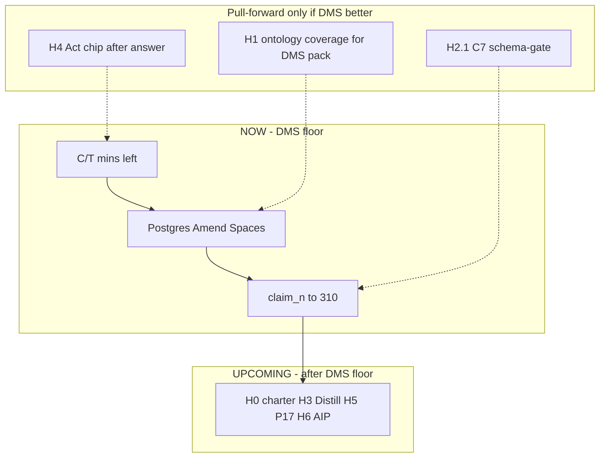

# DMS-anchored sequence — finish C/T + parking actives before H-depth

**Date:** 2026-07-31 · **Status:** binding order for Claude Code + Cursor  
**Answers:** Are C/T and parking-lot items *inside* the H plan, or before it?  
**Verdict:** **Before.** H horizons are the *engine depth* backlog. They do **not** replace finishing the DMS C/T line, Spaces product spine, or eval claim floor. Pull an H slice forward **only** when it directly improves the live DMS demo or unblocks a C/T exit gate.

---

## 0. Company shape (why this order)

| Layer | Job | Value |
|-------|-----|-------|
| **DMS** (`D:\DMS`) | First paying-shaped product: Spaces + governed ask on Excel/DB | Revenue proof, customer envelope |
| **Cortex** (`D:\Cortex`) | Engine: ontology, NL→SQL, ledger, agent SDK, Act | Multiplies every app (DMS, AirGPT, Clicks) |
| **OpenVault** | Keys + leave-machine gate + FreeRoute | Trust boundary for self-host + Act |
| **Netie Clicks** | Act / computer_control consumer | "Click" USP — not inside DMS chrome |

**USP chain for enterprise:** Ask (0 wrong) → Clarify → Answer + sources → Amend/Act via ontology → ledger.  
Ontology/agentic/Click deepen **Cortex** so DMS (and later every consumer) gets stronger — they are not a vacation from DMS.



---

## 1. Where we are (two folders, one mesh)

### Cortex (engine) — reached

| Item | Status |
|------|--------|
| C4-min, C6, T7-min (token+rewrite) | Done; **T7 live drillthrough** fixed (warehouse provenance fallback) |
| C5-min ToolClass + agent→apply refuse | Done this session |
| C8-min durable `query_run` | Done this session (DMS STATUS still says "parked" — **stale; update**) |
| C7 Protocol port (`sql_generation_port`) | Done (Claude); lint-imports green |
| C7 **product** schema-gate hardening | **Open** (W7 / H2.1) |
| C10-min paraphrase wrong=0 | Done; claim_n still 47 |
| Corpus expanded 376/376 wrong=0 | Done; claim needs `verify_gold --review` |
| Exclusion clarify + drillthrough | Done |
| Ontology/Trust read APIs | Done on :8010 |
| Depth plan H0–H6 | Written — **queued after this doc's NOW lane** |

### DMS (`D:\DMS`) — reached (from `STATUS.md` + this week)

| Item | Status |
|------|--------|
| T0–T8, T12/T13 | Done |
| Live ask + envelope E1–E8 path | Green on :8090 |
| Demo forecast abstain + drillthrough `compliance_gate` | In worktree / needs land to main |
| Ontology/Trust/Spaces/Runs/Admin UI | Built (Claude); Spaces still in-memory |
| `database_configured` | **false** on host — Postgres not published |
| C8 in DMS STATUS | Stale — engine C8-min shipped; DMS Runs UI still empty without DB |
| Near-term in DMS STATUS | C7-full, C10 grow, C8 — **align with Cortex order below** |

### Still parked (conditions hold)

| Item | Blocker | When |
|------|---------|------|
| CRAG | Spaces persist + inventory honesty | After Spaces |
| BIRD | Spaces + BIRD data local | After Spaces |
| Postgres host publish | Compose topology (Caddy-only public) | **NOW lane** — unlocks Amend/Spaces |
| OpenVault merge | Dirty branch other lane | When clean smoke |
| P1 Palantir *marketing* | Paying client + F hardened | H6 only after STATUS unpark |
| P2 WASM prod | Enterprise conversation | Keep host tool_runner |
| P4/P9 Closer | Paying partner | Out of DMS demo |
| P13 Web3 | H2 + profitable | Far |

---

## 2. Binding build order (NOW → NEXT → UPCOMING H)

### Phase NOW — finish C/T + DMS product spine (do this first)

Ordered. One exit gate per row. Claude Code pastes one prompt at a time.

| # | ID | Work | Exit gate | Status (2026-08-01) |
|---|-----|------|-----------|---------------------|
| 1 | **Ops** | Commit path lists; restart :8090 from main | Live ask + drillthrough + forecast abstain on :8090 | **Done.** Both repos committed in explicit slices. Live ask had been 503 all along — OpenVault `POST /keys/services` 500 from a **stale process** (A-0004), not code or data; restarted on its pinned home |
| 2 | **C7-prod** | Schema retrieval → sqlglot → EXPLAIN → retry → **plausibility** → abstain | wrong=0, envelope asserts | **Done.** Plausibility stage added (`CortexOS/dms/sql_plausibility.py`); gate no longer claims EXPLAIN ran when it did not; all candidates gated before a retry is spent. Found and fixed a **live P0**: `total revenue for SKU-00397` answered `sku_count = 509` |
| 3 | **C10/claim** | `bench.verify_gold --review --by <name>` waves | claim_n → 310 | **Blocked on a human, by design.** `--review` requires a TTY and a named reviewer; a batch importer would make the gate decoration. Still **47/310**, 329 unverified |
| 4 | **W1 Postgres** | Host-reachable DB for DMS | `database_configured: true` | **Done.** Control plane was already built (Alembic, RLS, roles, seed); the work was topology + 3 defects. `docker-compose.hostdb.yml` keeps Caddy-only-public intact |
| 5 | **W2 Amend** | Proposal → confirm → apply → receipt | Envelope + ledger green | **Done except the apply.** Receipt is now part of the write (failed append rolls the confirm back, token stays retryable). Confirm mutates no warehouse data and now **says so** — a real apply needs a contract minor + regenerated client |
| 6 | **W5 Spaces** | Persist + ACL enforce | Space boundary holds | **Persist done** (`PostgresSpaceStore.create`, honest `persisted`). **ACL enforcement open — see P0 below** |
| 7 | **C11** | Alias graph | Packet exit | **Done, without a third alias file.** The graph already exists in `metrics.yaml synonyms:` + `vocabulary.py _RULES`, both read on the serving path; C11-min was the missing *validation* |
| 8 | **C9-full** | Per P22 after C11 | Packet exit | Not started |
| 9 | **C4-full remainders** | Lakehouse duckdb outside CortexOS | lint + corpus | **Gap pinned, not closed.** The duckdb rule was documented in CLAUDE.md and enforced by *nothing*; ratcheted in `tests/dms/test_c4_duckdb_boundary.py`. Moving `lakehouse/catalog.py` is an architecture call |
| 10 | **OV smoke** | Keep pinned home; merge only when clean | healthz + JWKS + live ask | healthz/keys/live-ask green after restart. Merge still parked (dirty branch, other lane) |

### P0 still open — the Space boundary

`Executor.live_ask` mints from `demo_acl()` regardless of `space_id`, so every
Space reads the whole warehouse. Confirmed live: "Margin sandbox" holds only
`inventory` + `locations`, and a `transactions` question inside it returned the
full ranking, badge `L0_CERTIFIED`. `intersect_space_grants` /
`resolve_session_acl` are correct and tested but have **no production caller**.

Pinned as `xfail(strict=True)` in `D:\DMS\tests\test_space_acl_boundary.py`, so
the suite fails the moment it starts passing.

**Not wired, on evidence:** `DEMO_TABLES` needs 6 tables, `data_sources` covers
3 (`suppliers`, `shipments`, `alerts` have no row), and `acl_grants` has **0
rows** — so `list_user_source_grants` returns nothing and enforcement would
refuse **100% of asks** (R-0005). Turning it on needs a decision about which
sources are company-scoped vs Space-scoped, plus seed rows to match. That is a
product call, and shipping it half-on either breaks every demo ask or leaves the
boundary decorative.

**P22 ordered mins (updated truth):**

```
DONE: C4-min, C6, T7-min (+ live fix), C10-min, C5-min, C8-min, C7-Protocol
NOW:  C7-product → claim_n waves → C11 → C9-full → C4-full remainders
WITH: Postgres → Amend → Spaces  (DMS product; same NOW phase)
```

### Phase NEXT — only if it makes DMS better now (H pull-forwards)

| Pull | From H | Why DMS now |
|------|--------|-------------|
| Ontology pack coverage | H1.1–H1.4 | Library/Trust/agent grounding for DMS objects |
| Entity-clarify generalize | H2.2 | Same chip UX as wolf exclude |
| Act chip after answer | H4.1–H4.2 | USP: answer → do (Excel/open) via OV |
| Distill→KB for DMS loops | H3.1–H3.2 partial | Amend/Spaces/clarify workflows |

Do **not** start H0 full charter theater, H5 packaging, or H6 AIP Studio before NOW #1–6 are green.

### Phase UPCOMING — H horizons (after DMS floor)

| Horizon | When | Note |
|---------|------|------|
| H0 charter | Optional 1-day once NOW #1–3 green | Tone doc only |
| H1 remainder | After Spaces | Graph API, AIP patterns doc |
| H2.7 BIRD / CRAG | After Spaces | Eval plan Phase 2–3 |
| H3 full Distill OS | Parallel light; heavy after NOW | Skills sync |
| H4 full Click red-team | After one Act demo green | W-0001 |
| H5 P17/P18 | External builder ask | Engine product |
| H6 AIP depth | STATUS unparks P1 | Marketing-safe |

Full H text stays in [`NETIE_ENGINE_DEPTH_PLAN_2026-07-31.md`](../strategy/NETIE_ENGINE_DEPTH_PLAN_2026-07-31.md) + [`CLAUDE_CODE_ENGINE_DEPTH_PACKET.md`](packets/CLAUDE_CODE_ENGINE_DEPTH_PACKET.md) — **queued, not cancelled**.

---

## 3. Parking lot triage (what to touch vs leave)

| P# | Action in NOW/NEXT |
|----|-------------------|
| P12 Spaces | **Build** (W1→W2→W5) — product lock |
| P19 Distill | **Ongoing light** — findings after each wave |
| P22 C-line | **Build** remainders above |
| P16 agentic hooks | Pull only for Act confirm gates |
| P17/P17a | After DMS floor; OV merge when clean |
| P18 | Docs after API stable |
| P1 | Patterns OK; **no marketing** |
| P2–P11, P13, P20 | Leave parked |

---

## 4. Claude Code — paste order (DMS-first)

Replace "start at H0-A" with:

1. `CLAUDE_CODE_HANDOFF_NEXT.md` Prompt I (C7-prod)  
2. Prompt J (verify_gold review)  
3. Postgres topology (H2-3 from depth packet, reframed as NOW #4)  
4. Amend (H2-4) → Spaces (H2-5)  
5. C11 kickoff packet  
6. Then optional H1 ontology coverage for DMS pack  
7. Only then open `CLAUDE_CODE_ENGINE_DEPTH_PACKET.md` from H0/H3  

Session ritual unchanged: `kb.py search` → findings INDEX → end with finding.

---

## 5. Plugins / skills installed this session

| Skill | Cursor | Claude |
|-------|--------|--------|
| **ponytail** | `~/.cursor/rules/ponytail.mdc` + `D:\Cortex\.cursor\rules\` + `D:\DMS\.cursor\rules\` | Use `/plugin` in Claude Code UI (CLI marketplace) — Cortex already has `CortexOS/ponytail/` + `docs/PONYTAIL.md` |
| **i-have-adhd** | `~/.cursor/skills/i-have-adhd/SKILL.md` | Flag: `~/.claude/.i-have-adhd-always` **touched**; still run in Claude Code: `claude plugin marketplace add ayghri/i-have-adhd` then `claude plugin install i-have-adhd@i-have-adhd` |

Cursor does not fully honor `/plugin marketplace` the same way Claude Code does — rules/skills copy is the supported Cursor path (ponytail README).

---

## 6. Commit (when you ask)

Explicit path lists — never `git add -A`. Suggested buckets:

**Cortex:** drillthrough, exclusion clarify, values.py, C5/C8 files, tests, samples (SKU-BETA + Alha Wolf), docs (this file + depth plan + ACTIVE).  
**DMS:** AnswerMessage clarify chip, worktree demo_ask + chat drillthrough gate, STATUS C8 note.  
**Netie-KB:** findings F-0001–F-0004 + index (separate repo).

---

## 7. One-line for STATUS / handoff

> DMS floor first: C7-prod + claim_n review + Postgres→Amend→Spaces; C5/C8/T7-live already green. Engine H-depth (ontology/Act/Distill) is queued after; pull H slices only when they improve DMS. Ponytail + i-have-adhd installed for Cursor; Claude ADHD always-flag on.
