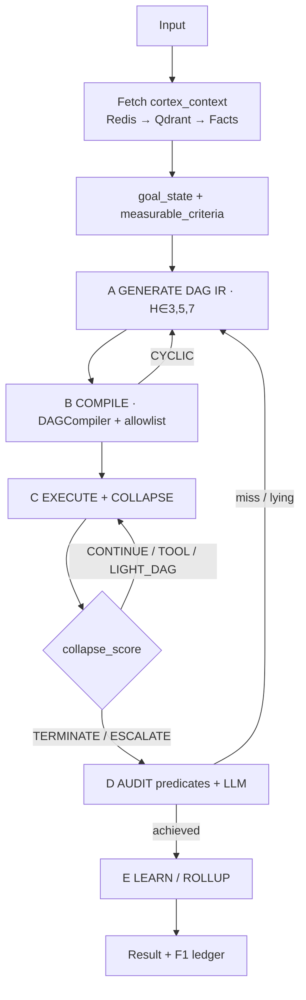

# G1 — Generative Constrained FSM + JEPA collapse (research)

**Track:** G1 (generative orchestration / H3 dual-brain precursor)  
**Status:** RESEARCH + DESIGN MERGED — no runtime code in this packet  
**Date:** 2026-07-24  
**Orchestrator:** Cursor Grok 4.5  
**Subagents:** [Research](58e5e3b1-86e6-4270-99f3-e8d503d7caf9) · [Design](ef98f03a-e914-4438-86b0-ba04135558f6) · [Stress](eed66404-2396-4a17-a8d9-13d9787e274d)  
**Companion:** [G1_STRESS_AGENT_BAKEOFF.md](G1_STRESS_AGENT_BAKEOFF.md) · canvas `gen-cfsm-bakeoff.canvas.tsx`

---

## 0. Verdict

1. **Rank #1 method:** Finite-horizon generative DAG (H∈{3,5,7}) → Mermaid/DSL IR → **DAGCompiler** → execute with mandatory check/verify + F1/F5 — formally finite, audit-native, fits Cortex spine.
2. **Rank #2 signal:** JEPA-style memory collapse — route by embedding distance to measurable goal; \(d(z_s,z_g)\approx -V(s,g)\) (arXiv:2601.00844). Start as proxy cosine + predicates, not full world-model training.
3. **Steal, don’t adopt:** AFlow/MermaidFlow for **offline** template search; Ctrl-G DFA + Constrained Process Maps for **online** horizon/escalation — not predetermined LangGraph edges.
4. **Memory:** Redis hot → Qdrant/RawKnn warm → MemPalace verbatim → Mem0-style facts. Habit learning in **external memory**, not weight updates (avoids catastrophic forgetting).
5. **Bake-off honesty:** On known warehouse SOPs, **static DAG already wins** (EST. composite ~4.1 vs gen-cFSM ~4.0). gen-cFSM earns the crown only on semi-novel measurable goals with AFP≈0 and hard horizon/cost — see stress doc gates.

---

## 1. Paper shortlist

| Paper | Year | Venue | Steal | Do NOT copy |
|---|---|---|---|---|
| **AFlow** ([arXiv:2410.10762](https://arxiv.org/abs/2410.10762)) | 2025 | ICLR Oral | MCTS / experience over workflows offline | Live overnight code mutation as orchestrator |
| **WorFBench** ([arXiv:2410.07869](https://arxiv.org/abs/2410.07869)) | 2025 | ICLR | Workflows as DAGs; subgraph acceptance tests | Linear-chain success = graph competence; GPT-judge alone |
| **Value-guided JEPA** ([arXiv:2601.00844](https://arxiv.org/abs/2601.00844)) | 2026 | arXiv | Distance ≈ −V(s,g) as routing/MPC cost | Pixel JEPA training as day-1 gate |
| **Constrained Process Maps** ([arXiv:2602.02034](https://arxiv.org/abs/2602.02034)) | 2026 | arXiv | Finite-horizon MDP; escalate to human terminal | Predefined SOP edges sold as “generative” |
| **Ctrl-G** ([arXiv:2406.13892](https://arxiv.org/abs/2406.13892)) | 2024 | NeurIPS | DFA on IR alphabet (must include verify) | Distill 2B HMM for Cortex IR day-1 |
| **MermaidFlow** ([arXiv:2505.22967](https://arxiv.org/abs/2505.22967)) | 2025 | arXiv | Verifiable IR + compiler-valid mutations | Evolutionary search as default online path |
| **Mem0** ([arXiv:2504.19413](https://arxiv.org/abs/2504.19413)) | 2025 | arXiv | ADD/UPDATE/DELETE/NOOP; episodic→semantic | SaaS lock-in; silent overwrite of audited facts |
| **MemPalace** | 2026 | OSS | Verbatim local vault; Qdrant backend | Replace F1 ledger with markdown |
| **Continual learning survey** ([arXiv:2403.05175](https://arxiv.org/abs/2403.05175)) | 2024 | arXiv | Replay/LoRA only if fine-tuning later | Fine-tune base LLM on every habit |
| **OpenClaw** | 2026 | OSS | Serial session queues; 3-tier memory; explicit terminate | Free ReAct/shell as warehouse SoT |

**Method rank for Cortex:** (1) finite-horizon gen-DAG+compiler (2) JEPA collapse proxy (3) offline AFlow/MermaidFlow (4) Ctrl-G DFA on IR (5) Process-Maps escalation discipline (6) Mem0/MemPalace cold layer (7) LangGraph/ReAct/OpenClaw as non-SoT baselines only.

---

## 2. Formal model

### Finite-horizon MDP + Hierarchical FSM

\[
\mathcal{M}_H=(\mathcal{S},\mathcal{A},P,R,H,s_0,\mathcal{S}_\text{term}),\quad H\in\{3,5,7\}
\]

| Symbol | Meaning |
|---|---|
| \(s\) | Redis turns + retrieved memory + partial DAG IR + spend + compliance flags |
| \(a\) | emit/refine DAG, execute layer, verify, confirm-gate, escalate, halt |
| \(\mathcal{S}_\text{term}\) | success, fail, cost_ceiling, compliance_deny, human_review, horizon_exhausted |

**Timescales (H-JEPA-inspired, no JEPA training required):**
- L2 goal FSM → measurable \(g\) + criteria  
- L1 phase FSM → generate DAG \(G=(V,E)\) with \(|V|\le H\)  
- L0 node FSM → typed nodes via `dag_runner`

**Constraint stack:** acyclicity (Kahn) · reachability prune · horizon · Ctrl-G alphabet (must check→verify→emit) · CostLedger · F5 deny.

**Generative ≠ predetermined:** planner proposes \(E\) at plan-time; compiler validates; templates may *bias*, never *be* SoT.

---

## 3. Architecture (design contract)

### State schema (core fields)

`input`, `cortex_context`, `goal_state`, `measurable_criteria[]`, `step_count`, `horizon∈{3,5,7}`, `dag_ir`, `compiled_dag`, `collapse_score`, `audit_verdict`, `memory_refs`, `node_allowlist`, `cost_spent_myr`, `requires_confirm`, `reward`/`loss`, `prior_path_ids`.

**Goal fetch rule:** resolve goal + criteria *before* Phase A — never invent mid-loop without predicates.

### Collapse router

\[
s_t=\mathrm{clip}_{[0,1]}(\cos(e_t,e_g))
\]

| Band | Score | Action |
|---|---|---|
| TERMINATE | \(s\ge0.92\) **and** criteria pass | → Audit |
| CONTINUE | \(0.70\le s<0.92\) | Next topo node |
| TOOL | \(0.45\le s<0.70\) | Allowlisted TOOL_CALL |
| LIGHT_DAG | \(0.25\le s<0.45\) or plateau \(\Delta s<0.02\) | ≤3-node T0/T1 repair |
| ESCALATE | \(s<0.25\) or 2× LIGHT fail or cost>80% | T2/T3 + confirm |

Hard overrides: `step_count≥H`, cycle regen budget, cost ceiling, F5 deny.  
**Anti-lie:** collapse proposes TERMINATE; audit + predicates grant it.

### Reward (Phase E)

\[
R = R_\text{goal}\cdot\mathbf{1}[P] + R_\text{eff}\cdot\frac{H-n}{H} - \lambda\cdot\text{MYR} - R_\text{lie}\cdot\mathbf{1}[\text{lying}] - R_\text{cycle}\cdot\mathbf{1}[\text{reject}]
\]

High-\(R\) stable `dag_hash` → habit fact; next run may shrink horizon (floor=3). Fetch-before-forget on habit merge.

---

## 4. Memory vault (laptop)

| Tier | Store | Retention | Use |
|---|---|---|---|
| Hot working | Redis `working:` (2h / 10 turns) | Session | collapse, step_count, turns |
| Warm episodic | RawKnn → Qdrant | weeks | similar goals, Δ traces |
| Warm-cache | semantic_cache | short | skip T2/T3 dupes |
| Verbatim vault | MemPalace | durable | fetch-before-forget; audit replay |
| Cold habits | Mem0-style facts | durable + decay | preferred paths / horizon priors |
| Audit | F1 ledger | append-only | every GENERATE/EXEC/AUDIT |

---

## 5. Bake-off (ESTIMATED composites)

From [Stress](eed66404-2396-4a17-a8d9-13d9787e274d) equal-weight means:

| Architecture | Composite |
|---|---|
| C Static Cortex DAG | **~4.1** |
| E gen-cFSM (proposed) | **~4.0** |
| A LangGraph generative router | ~2.9 |
| B LangChain ReAct | ~2.6 |
| D OpenClaw-style free agent | ~1.7 |

**When each wins:** static DAG → S1 known detect→draft; gen-cFSM → S2 semi-novel branches + S4/S6/S7 integrity; ReAct → fuzzy exploration (supervised); OpenClaw → demos/breadth, not GAR/CCC.

Full scenarios, formulas, and claim gates → [G1_STRESS_AGENT_BAKEOFF.md](G1_STRESS_AGENT_BAKEOFF.md).

---

## 6. Cortex file mapping

| Concern | Reuse | Add (proposed) |
|---|---|---|
| IR + acyclicity | `fabrication/dsl_parser.py`, `dag_compiler.py` | `execution/gen_cfsm_ir.py` |
| Execute + cost | `dag_runner.py`, CostLedger | collapse hooks wrapper |
| Orchestrate A–E | `run_plan.py`, `architecture_presets.py` | preset `generative_fsm` → `constrained_fsm.py` |
| Governed intents | `packs/dms/generative/brain.py` | intent `plan_generative_dag` |
| Memory | `memory/*`, `personality/memory.py` | `memory/vault_layers.py` |
| Audit | F1 + F5 | `execution/goal_audit.py` |
| Collapse | cosine in store | `execution/collapse.py` |
| Cascade later | Activepieces (not n8n) | `execution/cascade_activepieces.py` |

**Non-goals:** LangGraph core dep · unbounded agent · third orchestrator · n8n default · success-by-eloquent-LLM · weight-level habit FT this quarter.

---

## 7. Implementation order

| Phase | Scope | Exit |
|---|---|---|
| **P0** | Schema + GENERATE→COMPILE dry-run; H∈{3,5,7}; cycle reject | 100% CI on cycle/horizon unit tests |
| **P1** | Collapse + predicate AUDIT; Redis working; lying stub | AFP=0 on S7-class test |
| **P2** | Wire `dag_runner` + CostLedger + Qdrant retrieve; stub bake-off | S1/S4/S6 gates green |
| **P3** | MemPalace + Mem0 ops + habit shrink; offline AFlow templates | CF≤0.1 on S5; Activepieces sketch |

**1-week laptop MVP (Design):** Day1 criteria checkers → Day2 stub generator → Day3 real DAGCompiler → Day4 collapse wrap → Day5 audit → Day6 memory façade → Day7 preset + F1 demo.

---

## 8. Risks

| Anti-pattern | Guard |
|---|---|
| Predetermined edges marketed as generative | Plan-time \(E\) + `dag_hash` required |
| Lazy / goal-lie LLM | Predicates gate TERMINATE; separate verify node |
| Unbounded research | Hard H + cost ceiling + horizon_exhausted |
| Online AFlow MCTS | Offline only; online beam≤k under DFA |
| Summary-only memory | MemPalace verbatim + fetch-before-forget |
| Semantic overwrite without audit | Mem0 ops emit F1 events |
| Marketplace LangGraph as default | Keep `DEFAULT_PRESET=minimal`; adapters gated |

---

## 9. Grounding checklist

| Capability | Status |
|---|---|
| DAGCompiler Kahn + prune | Shipped |
| dag_runner + CostLedger | Shipped |
| Generative brain intents | Shipped |
| Redis working memory | Shipped |
| RawKnn / MemoryContextProvider | Shipped (M0) |
| Qdrant dense | Partial |
| T0–T3 + Ponytail | Shipped |
| F1 + F5 + confirm | Shipped |
| Live gen-cFSM orchestrator | **P0/P1 shipped** (`gen_cfsm.execute_cfsm` / `iterate_cfsm`; AFP false-pass catch) |
| Mem0 / MemPalace productization | **Not shipped** (rollup stub) |
| LangGraph as Cortex core | **Not shipped** (preset stub) |
| Enterprise open-set loop (G2) | **PLAN** — `docs/strategy/ENTERPRISE_GEN_CFSM_LOOP_PLAN.md` · P21 |

**Continuation:** G1 P2/P3 (wire + habits) folds into **G2** (goal bind, OSR, action-value JEPA, telemetry, proactive idle, update port). Do not open a third orchestrator.

---

## Bottom line

Cortex’s advantage today is **governed static DAG + ledger + 0-LLM detect**. gen-cFSM is worth building only as a **bounded compiler into that spine**: generative edges, JEPA collapse, oracle audit, vaulted habits. Measure predicates; starve vibes. Claim superiority only after stress gates in companion doc are MEASURED green. **Next program:** ethical enterprise goal-binding + open-set everyday loop (G2 / P21).
