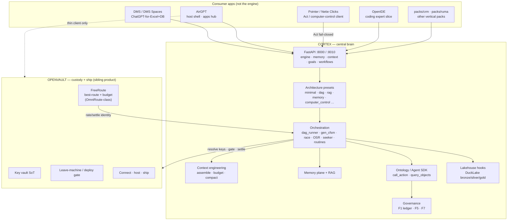

# Cortex Whitepaper — Architecture, Apps, Roadmap, Branches

**Status:** Canonical design thesis (P18) · **Measured:** 2026-07-29  
**Companions:** [`CORTEX_FINAL_GOAL.md`](CORTEX_FINAL_GOAL.md) · [`PRODUCT_ROLES.md`](../../PRODUCT_ROLES.md) · [`ENGINE_SDK_DUAL_BRAIN_PLAN_2026-07-23.md`](ENGINE_SDK_DUAL_BRAIN_PLAN_2026-07-23.md) · root [`ARCHITECTURE.md`](../../ARCHITECTURE.md)

> Do not present planned work as shipped. Shipped vs partial is marked below and in `ARCHITECTURE.md`.

---

## 1. What Cortex is

**One line:** Cortex is the **governed agentic engine** — MoE / architecture presets, orchestration, memory, retrieval, lakehouse, ontology-gated writes — that apps plug into. It is **not** a vertical product.

| Cortex **is** | Cortex **is not** |
|---|---|
| Orchestration brain (DAG, presets, gen-cFSM, OSR, seeker) | A warehouse WMS you rip-and-replace with |
| Engine capability (memory, context engineering, hybrid RAG, lakehouse hooks) | The key vault or deploy console |
| Shared governance spine (F1 ledger, F5 compliance, F7 RBAC) identical for human and agent | A second OpenVault or third orchestrator |
| Hosted API **and** downloadable “netie engine” self-host surface (P17) | AirGPT’s phone chrome or Pointer’s click loop |

**Design thesis:**

> **Ontology-as-memory + LLM-as-reasoner + actions as the only write path.**  
> Reads go through RBAC / PII / sqlglot. Writes go through `call_action` (or pack-equivalent) → compliance → ledger. Never a bypass path for agents that humans do not also have.

**North-star test for any PR:** *Does this make the engine better, or is it just another app on top?* Apps belong in packs / sibling repos; engine work lands in `CortexOS/`.

---

## 2. Full system diagram (ecosystem)



**Safe path (non-negotiable):**

```
App → Cortex (think / MoE / DAG) → OpenVault (where + keys + may this leave?) → run/deploy
                              ← OpenVault ships only what passed gate
         ← Cortex continues under ledger / write gate
```

Omni-retrieve or leave-machine **without** OpenVault as gate = unsafe. Cortex thinks; OpenVault custodians.

---

## 3. How Cortex works (runtime loop)

### 3.1 Request / task path

1. **Ingress** — chat, `/dms/query`, webhook `/fire`, Seek tick, routine schedule, Act from Pointer.
2. **Trust wrap** — external text is untrusted-wrapped before OSR / LLM (`execution/untrusted_payload.py`).
3. **Architecture preset** — Cortex picks (or config pins) `minimal | sequential | dag | rag | memory | computer_control | …` (`execution/architecture_presets.py`). Does **not** spawn a second orchestrator.
4. **Open-set / known path** — OSR bands `known | near | open` → reuse winner / race top-3 / gen-cFSM (`execution/osr.py`).
5. **Proactive seek** — when headroom exists and a goal is bound, seeker proposes next actions toward \(g\) without waiting for mail (`execution/seeker.py`, G2.1+).
6. **Context assemble** — layered budgeted context (`context_engineering/`, Ponytail).
7. **Model route** — Cortex `ModelRouter` + cost ledger; **spend / FreeRoute budget** settled via OpenVault.
8. **Execute** — DAG / workflow / ontology `call_action`; writes only through gated actions.
9. **Learn** — ActionEvent + action_value (explicit user outcome ≥ inferred); scoreboard families; commitments recovery.
10. **Audit** — F1 hash-chained ledger; identifiers-first telemetry (no prompt bodies in engine telemetry stores).

### 3.2 Data planes (DMS-shaped consumers)

| Plane | Role |
|---|---|
| **Hot analytical** | DuckDB warehouse (`/dms/query`) — sqlglot SELECT-only; abstain-first |
| **Lakehouse** | DuckLake bronze → silver → gold; sync silver → warehouse for Q2 |
| **Ops / ledger** | SQLite demo → Postgres target; F1 chain |
| **Blob / index** | Files + BM25/dense (Spaces product track) |
| **Memory** | Cortex `/api/memory/*` — OpenVault may *signpost*, never own |

### 3.3 Ports (typical local stack)

| Port | Owner |
|---|---|
| **8000** | Cortex API (pack=`dms` demo) |
| **8010** | Cortex engine surface (routines / seek / OSR / Act) |
| **3000** | `demo/dms-ui` smoke UI |
| **5000** | OpenVault (default) |
| **8765** | AirGPT API (host shell) — reserved; not Cortex |

---

## 4. Apps that sit on Cortex

Canonical contract: [`PRODUCT_ROLES.md`](../../PRODUCT_ROLES.md). Keep identical across Cortex · OpenVault · AirGPT · OpenIDE.

| Surface | Job | Interaction with Cortex |
|---|---|---|
| **OpenVault** | Keys SoT, leave-machine/deploy gate, **FreeRoute** (best-route + budget — OmniRoute-class), connect/host | Cortex **asks**; OV allows/denies. `integrations/openvault_client.py`, `openvault_gate.py`, `workflow_openvault.py`. P17a trust root + `verify_bundle` unblock G2.6. |
| **DMS** | Reference vertical + product: warehouse ops + **ChatGPT-for-Excel/DB** | Pack `packs/dms/` + plug-in routes. Product UI spinning out to sibling **`D:\DMS`**. |
| **DMS Spaces (“Netie Space”)** | Named sandboxes: chat/retrieval/amend scoped to selected sources only | Product architecture locked in [`DMS_SPACES_PRODUCT_2026-07-29.md`](DMS_SPACES_PRODUCT_2026-07-29.md). Runs **on** Cortex engine + lake/query; Spaces ACL is data-plane enforce. |
| **AirGPT** | Phone / settings / pairing / apps hub — **thin** control plane | Sidecar + Agent SDK bridge (O5). Must not become second vault or third orchestrator. Seek/Routines UI proxies Cortex. |
| **Pointer / Netie Clicks** | External **Act** client (computer-control) | Calls Cortex Act on `:8010`; fail-closed; OSR band after plan. **Out of DMS Spaces demo scope.** |
| **OpenIDE** | Coding expert activation | Asks Cortex for brain/tools; no deploy console. |
| **Constructor** | n8n-shaped canvas + ontology sketch | Skin: `/cortex/constructor/`, `GET /api/connectors`. Not a second orchestrator. |
| **Cortex Crew** | Grok-bot agentic chat | Skin on :8020; `cortex_ask` + OpenVault. Must not grow a second brain. |
| **Netie Control / Plane** | Launch + estate status | Watchdog display; does not think. |
| **Other packs** | `packs/crm`, `packs/ruma`, … | Same Agent SDK + governance; O7 `new_pack` scaffolds. |

### OpenVault ≈ FreeRoute (honest naming)

OpenVault’s routing product surface is **FreeRoute** (legacy alias OpenFree). Cortex treats it as:

- **best available route** among providers/tiers under policy,
- **budget / ratelimit / settle** for workflow identities `wf:{run_id}:{node_id}`,
- **not** Cortex’s architecture-preset picker (that stays in Cortex).

So: FreeRoute is the OmniRoute-class **custody+spend router**; Cortex is the **orchestration/MoE brain**.

---

## 5. Repo structure (this tree)

```
Cortex/                          # git root — engine + DMS reference pack
├── CortexOS/                    # Engine runtime (canonical package)
│   ├── api/                     # FastAPI routes (engine, memory, context, goals, …)
│   ├── agent_sdk/               # Blessed in-process SDK surface + hooks
│   ├── execution/               # DAG, gen_cfsm, OSR, seeker, routines, apps, workflows
│   ├── engine/                  # Registry, lubricant, bakeoff, just_works
│   ├── context_engineering/     # Layered assemble / budget / compact
│   ├── memory/ · rag/           # Memory plane + retrieval
│   ├── integrations/            # OpenVault client + gate
│   ├── discovery/               # Find skills / MCP / subagent refs (lazy load)
│   ├── ontology/ · compliance/  # Governance helpers
│   ├── routing/ · ponytail/     # Cost / context pressure
│   ├── dms/                     # Answer engine / warehouse helpers used by pack
│   └── AirGPT/                  # Sidecar tree (host shell code may also live out-of-repo)
├── packs/
│   ├── dms/                     # First reference consumer (ontology, semantic, skills)
│   ├── crm/ · ruma/             # Additional packs
│   └── data/                    # Ops DB artifacts (careful: demo state)
├── demo/dms-ui/                 # Engine smoke / legacy demo (product → D:\DMS)
├── bench/ · tests/              # Accuracy, paraphrase, orchestration gates
├── docs/strategy/               # This whitepaper + goals + G2 plan
├── skill_distill/               # Captured Claude/Cursor orchestration knowledge
├── scripts/                     # start engine, lakehouse, distill ingest
└── PRODUCT_ROLES.md · STATUS.md · ARCHITECTURE.md · PARKING_LOT.md
```

**Sibling products (not inside this git tree as SoT):**

| Path / product | Role |
|---|---|
| OpenVault (separate repo / `:5000`) | Keys, gate, FreeRoute, ship |
| `D:\DMS` | Forward-deployable DMS Spaces product UI/API |
| Pointer | External Act app |
| AirGPT install | Host shell; may mirror code under `CortexOS/AirGPT/` |

---

## 6. Roadmap (precise, current)

### 6.1 Engine product (what we sell)

| Horizon | Focus |
|---|---|
| **Now** | Best-engine bar: orchestration + capability; dual consume modes (hosted API · self-host) |
| **P17** | Hosted API layer + downloadable netie-engine packaging |
| **P17a** | OpenVault trust root + offline `verify_bundle` + anti-rollback generation (unblocks G2.6) |
| **P18** | **This whitepaper** + API docs + architecture reference (O2 map) |
| **P21 / G2** | Proactive enterprise goal loop — see below |

### 6.2 G2 enterprise loop (engine — shipped vs next)

| Phase | Name | State (2026-07-29) |
|---|---|---|
| G2.0 | Goal binding + ethical predicates | Shipped |
| G2.1 | Proactive seeker | Shipped |
| G2.2 | Action-value learning + audit-native goals | Shipped |
| G2.3 | Open-set recognition (OSR) | Shipped |
| G2.4 | ActionEvent telemetry + explicit≥inferred | Shipped |
| G2.5 | Commitments / forget-recovery | Shipped |
| G2.6 | Signed update port + OAuth | **Blocked on OpenVault P17a** |

Litmus: *If nobody messages for an hour, does the engine still advance \(g\) safely?*

Full plan: [`ENTERPRISE_GEN_CFSM_LOOP_PLAN.md`](ENTERPRISE_GEN_CFSM_LOOP_PLAN.md).

### 6.3 DMS Spaces product track (consumer)

Binding: [`DMS_SPACES_PRODUCT_2026-07-29.md`](DMS_SPACES_PRODUCT_2026-07-29.md).

| Phase | Work |
|---|---|
| 0 | Postgres ops + ledger + RLS |
| 1 | Amend Proposal loop (confirm token + verify) |
| 2 | Schema-retrieval validation gate |
| 3 | Column lineage |
| 4 | DuckLake catalog → Postgres; MinIO when swamp real |
| 5 | Packaging (installer, backup, verify-ledger) |
| S | Spaces MVP (scope ∩ ACL) — parallel once ACL exists |

**Decline:** petabyte ETL, “thousands of connectors,” 100TB analytics claims.

### 6.4 Business horizons (Malaysia wedge)

From [`NETIE_CORTEX_MASTER_PLAN.md`](NETIE_CORTEX_MASTER_PLAN.md): H1 earn on warehouse SMEs → H2 mid-market layer → H3 dual-brain kingdom. Engine work (this whitepaper) is the durable asset; verticals prove it.

### 6.5 Ontology / dual-brain landing (Option B via path C)

Decision 2026-07-23: **no big-bang merge** of `netie-engine` into `main`. Land capabilities one gate at a time.

| Wave | Item | State |
|---|---|---|
| O1–O2 | Ontology registry + codebase map | Shipped on `main` |
| O3–O5 | Action allowlist · Agent SDK · AirGPT via SDK | Shipped on `main` |
| O7 | New-pack generator | Shipped on `main` |
| Context eng | Layered assembler + API | Shipped (`feat/…` merged) |
| G2.0–G2.5 | Seek / OSR / telemetry / commitments | Shipped in working tree / STATUS |
| Remaining | P17 packaging, P17a OV, G2.6, Spaces phases, MemPalace/JEPA train | Open |

---

## 7. Git branches — measured truth (2026-07-29)

```text
origin/main ── 781c81b (O7 + P16)
                 │
                 ▼
main / fix/deterministic-skill-embedding ── cd66578
                 ▲
                 │ (feat fully merged; main is ahead)
feat/context-engineering ── be945ac

netie-engine ── 028fbfb   ← DIVERGED feeder (not fully merged)
   merge-base with main: d86a3e0 (dms-v2 era)
```

| Branch | Tip | Relation to `main` | What it is about |
|---|---|---|---|
| **`main`** | `cd66578` | Integration trunk. **Ahead of `origin/main` by 1 commit** (skill-embedding fix not pushed). Working tree also holds large uncommitted G2/Spaces/engine work. | Canonical home for governance + landed engine capabilities + DMS pack. **Use this.** |
| **`fix/deterministic-skill-embedding`** | `cd66578` | **Identical tip to `main`.** | One-commit fix: deterministic skill embeddings across workers/restarts (`packs/dms/skills/capture.py` + tests). **Already on main — safe to delete after push.** |
| **`feat/context-engineering`** | `be945ac` | **Ancestor of `main`** (fully merged). `main` has 7+ later commits (O3–O7, skill fix). | Shipped layered context engineering (`CortexOS/context_engineering/*`, `/api/context/*`, Ponytail integrate). **Historical — safe to delete.** |
| **`netie-engine`** | `028fbfb` | **Diverged.** Not an ancestor of `main`. Parallel history from `d86a3e0`. | Original **Brain B** R&D feeder: Engine Up E0/M0, rawknn, DuckLake L0, Q1/Q2, streams, fat AirGPT tree. Checkpoint message: *before checking out dms-integrated-engine*. Capabilities were **cherry-picked into `main` via path C**; tip is **not** current SoT. Do **not** rebase onto main. Keep as archive/feeder until P15 closed; prefer capability PRs off `main`. |

### Dual-brain status (updated)

| | Brain A — Application / governance | Brain B — Engine / runtime |
|---|---|---|
| **Original branches** | `main` | `netie-engine` |
| **2026-07-29 reality** | Still `main` | **Most engine capability now lives on `main`** (landed). `netie-engine` tip is stale relative to G2/OSR/seek/context. |
| **Policy** | Option B via C remains: never big-bang merge; land by capability | Treat `netie-engine` as read-only archive unless a specific unported file is needed |

### Branch hygiene recommendations

1. Push `main` when ready (`cd66578` ahead of origin).
2. Delete local/remote `feat/context-engineering` and `fix/deterministic-skill-embedding` after confirming CI green on pushed main.
3. Tag `archive/netie-engine-028fbfb` if you want a freeze; leave branch for archaeology.
4. New work: **branch from `main`**, never from `netie-engine`.

---

## 8. Honest “not yet” (do not demo as done)

- MemPalace / Mem0 / **trained** JEPA (proxies exist; do not claim trained)
- MinIO 500GB object store / full Spaces ACL product
- G2.6 update port (needs OpenVault P17a)
- Production WASM / microVM
- “Thousands of connectors” / petabyte lakehouse
- Third orchestrator (forbidden) · second key vault (forbidden)

---

## 9. How to read this repo day-to-day

| Need | Open |
|---|---|
| What shipped this week | `STATUS.md` |
| Next prompts | `docs/dms/packets/NEXT_LANES.md` |
| Built vs partial inventory | `ARCHITECTURE.md` |
| Product role disputes | `PRODUCT_ROLES.md` |
| Engine goal | `docs/strategy/CORTEX_FINAL_GOAL.md` |
| **This thesis** | `docs/strategy/CORTEX_WHITEPAPER.md` |
| Agentic loop vs Cursor/Claude (plan) | `docs/strategy/AGENTIC_LOOP_CAPABILITY_PRD_2026-08-25.md` |
| Spaces product | `docs/strategy/DMS_SPACES_PRODUCT_2026-07-29.md` |
| Deferred ideas | `PARKING_LOT.md` |

---

*P18 deliverable. Update when branch tips or G2/P17 state changes; keep diagrams honest.*
