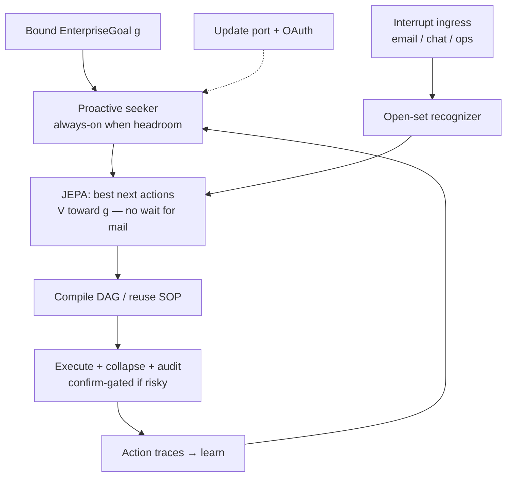

# Enterprise gen-cFSM loop — goal-driven, open-set, self-evolving

**Date:** 2026-07-26 · **Status:** PLAN (add to roadmap; build by phase)  
**Trace:** extends `docs/research/findings/G1_GEN_CFSM_JEPA.md` + `docs/strategy/CORTEX_FINAL_GOAL.md`  
**Parking:** **P21** (this program) · rides with P17 (update channel / auth) · P12 (company brain)  
**Rule:** Cortex stays **the engine**. “Make the enterprise more money ethically” is a **bound objective**, not a vertical product baked into the core.

---

## 0. Key idea (non-negotiable)

> **Actively do stuff. Do not wait to be asked.**
> Proactive agency is the product posture. Reactive handling of inbox/events is necessary but secondary.

| Mode | Role | Default? |
|---|---|---|
| **Proactive** | Seek the bound goal: predict needs, prep meetings, draft next moves, close open loops, surface forgotten commitments, propose routines from patterns | **Yes — always on when budget/headroom allows** |
| **Reactive** | Open-set ingress when email/chat/ops arrives → recognize → DAG → execute | Fallback / interrupt path |

**Litmus test for any G2 slice:** *If the user stays silent for an hour, does the engine still advance the ethical enterprise goal (safely, confirm-gated where needed)?* If no → the slice is still reactive-only and incomplete.

JEPA’s job is not only to rank replies to stimuli — it is to **predict the best next actions that move \(s\) toward \(g\)** even when no new message arrived.

---

## 0.1 One-line thesis

> The engine **continuously seeks** an ethical enterprise-value goal: JEPA-predicts the best next actions, generates constrained DAGs for novel work, executes under F1/F5/F7, learns from clean compressible traces — and only secondarily **reacts** to open-set ingress (email/chat/ops). Free capacity is spent **one step ahead** for the user. A minimal signed **update port** + OAuth keeps the local app current.

---

## 1. What already exists (do not rebuild)

| Piece | Where | Role in this plan |
|---|---|---|
| Finite-horizon gen-cFSM P0/P1 | `execution/gen_cfsm.py` | GENERATE→COMPILE→EXECUTE+AUDIT; false-pass catch |
| JEPA **family** gate (64-dim proxy) | `execution/scoreboard.py`, `race_router.py` | Route known families; direct vs race |
| Routines + governor | `execution/routine_scheduler.py` | Everyday tick; cost/error pause |
| One-sentence routine composer | `execution/routine_composer.py` | Zero-knob schedule from English |
| Step journal | `execution/step_journal.py` | Content-addressed node results |
| F1 ledger / F5 / F7 | packs/dms + agent_sdk | Ethical + compliance spine |
| App package + update-ish install | `execution/app_package.py` | Local apps; human approve |
| Hosted/self-host product surface | PARKING_LOT **P17/P18** | API + downloadable engine |

**Gap this plan fills:** **proactive goal-seeking as default** (not ticket/inbox-reactive) → open-set recognition when interrupts arrive → goal-bound action value (not only family match) → novel DAG generation for unknowns → compressed trainable telemetry → daily signed update channel + minimal OAuth.

**Foundation already shipped (2026-07-26):** one-sentence routines + folder→described/gated/dockerized apps. Same UX law must carry into G2: guesses always visible (`assumptions` / `about.will_do`); approval + secret stripping stay manual. That foundation is still schedule/react-bound — **G2.1 seeker is the active AI**.

**Today’s bias to invert:** routines + `/fire` are mostly *schedule/react*. G2 must make the tick **goal-seeking**: when nothing is due, still ask “what moves \(g\) next?” and queue safe drafts/preps.

**Claude build packet:** `docs/dms/packets/CURSOR_TO_CLAUDE_G2_SEEK_2026-07-26.md`.

---

## 2. Objective binding (enterprise money — ethical)

### 2.1 Engine vs consumer

| Layer | Owns |
|---|---|
| **Engine** | Goal schema, predicates, JEPA value \(V(s,a,g)\), gen-cFSM, telemetry schema, update channel, auth hooks |
| **Consumer pack** (DMS / CRM / AirGPT org) | Concrete \(g\) = “ethically increase revenue / margin / cash safely”; industry predicates; email connectors |

### 2.2 Canonical goal object (engine schema)

```text
EnterpriseGoal {
  id, org_id,
  statement: "Increase enterprise value ethically",
  measurable_criteria[]: { name, metric, direction, floor|target, evidence_source },
  hard_constraints[]: { safety, security, legal, consent, no_deception, no_illegal },
  soft_preferences[]: { latency, cost_myr, autonomy_level },
  audit_required: bool
}
```

**Non-negotiable:** TERMINATE / auto-act only if **predicates ∩ hard_constraints** pass. Collapse score alone never ships money-moving actions.

### 2.3 Ethical money = positive objective + veto set

- **Optimize:** revenue, retention, conversion, cost-to-serve (pack-defined metrics).
- **Never optimize by violating:** F5 deny, secrets exfil, deceptive comms, unconfirmed irreversible actions, dark patterns.
- All goal progress events → F1 ledger with `goal_id` + `predicate_results`.

---

## 3. Everyday loop — proactive primary, reactive secondary



**Priority when both fire:** finish or park the current safe proactive step; treat high-urgency ingress as interrupt with governor fairness (never starve seeking forever, never ignore hot email forever).

### 3.1 Open-set recognition (OSR)

| Case | Signal | Action |
|---|---|---|
| In-distribution | JEPA family cosine ≥ τ + prior wins | Reuse winner preset / DAG hash |
| Near-novel | Mid band | Top-3 race (existing) |
| Open-set | Below τ **or** new entity/intent schema | **Generate** finite DAG (gen-cFSM); never free ReAct as SoT |

OSR must emit: `{known|near|open, family_id?, novelty_score, proposed_horizon}`.

### 3.2 Reactive ingress (secondary path)

1. **Email / message fire** — already: `POST /api/routines/{id}/fire` untrusted wrap → extend to goal-bound auto route.
2. **Chat history recall** — “forgot → search prior turns” as memory retrieve before plan (context engineering + vault).

### 3.3 DAG generation for new things

- **Source of truth:** Cortex `gen_cfsm` → `DAGCompiler` → `dag_runner` (one spine).
- **LangGraph / marketplace adapters:** optional emit targets only (`adapter_unavailable` until real); never replace compiler or ledger.
- Each novel plan carries: `dag_hash`, `horizon`, `goal_id`, `predicates[]`, `cost_ceiling`.

### 3.4 Proactive seeker (primary path — always-on)

Not an “idle nicety.” The seeker runs whenever the governor has headroom (`CORTEX_ROUTINES_DAILY_CAP_MYR` + CPU). Silence from the user is **not** idle — it is the normal case.

| Behavior | Example |
|---|---|
| Goal step | Pick highest \(V(s,a,g)\) safe action toward enterprise goal |
| Predict next need | Prep tomorrow’s meeting pack before anyone asks |
| Pattern learn | User always asks X after email from Y → draft routine + optionally arm it |
| Forget recovery | Surface unread commitments from chat history |
| Reminder / close loop | Due predicates from prior goals; unfinished drafts |

**Autonomy ladder:** low-risk allowlist may auto-execute; everything external/irreversible stays **draft / suggest** until confirm. Proactive ≠ reckless.

---

## 4. Telemetry → trainable self-evolving optimizer

### 4.1 Store clean parsed actions (local-first)

Every node / tool / human decision becomes an **ActionEvent**:

```text
ActionEvent {
  ts, org_id, user_id?, session_id, goal_id,
  state_sketch, action_type, tool, args_redacted,
  outcome, predicate_results, cost_myr, tokens,
  dag_hash, node_id, novelty_class
}
```

- PII redacted before leave-box (F7).
- Prefer **structured fields** over raw blobs; attachments compressed separately.

### 4.2 Compress + uplink (opt-in)

| Path | Purpose |
|---|---|
| Local `data/engine/action_traces/` | Full fidelity for replay / habit |
| Daily micro-bundle (zstd/cas) | Differentials of ActionEvents + optional file digests |
| Upload | Only with account + consent; signed device identity |

**Trainable road:** offline AFlow/MermaidFlow-style search + scoreboard habit shrink (G1 P3) — **not** online weight mutation of the base LLM.

### 4.3 Self-evolving optimizer (definition)

1. High-reward stable `dag_hash` → habit (horizon shrink floor=3).
2. Open-set wins → new family centroid in scoreboard.
3. False-pass / lying → permanent negative prior (AFP gates).
4. Optional SkillOpt / discovery evolve stays gated (`evolve=true`).

---

## 5. Update channel + minimal auth (local app)

Local app, but **needs a port** for:

1. **Daily auto-receive** of update manifests (micro updates).
2. **User press → auto-fetch → apply** (confirm UI; never silent force).
3. **Account registration / OAuth** for identity, consent, signed bundles.

### 5.1 Design constraints

- **Minimal shared hardware / OAuth surface** — thin IdP (device code or OAuth PKCE); secrets in OpenVault (P17a), not in app config plaintext.
- Update listener binds `CORTEX_UPDATE_PORT` (dedicated; not 8010 engine API, not 8765 AirGPT).
- Manifest: version, channel, content-hash, signature, changelog micro, optional action-schema migrations.
- Apply path: verify sig → stage → health check → swap → ledger `engine.updated`.

### 5.2 Relation to P17

P17 = product packaging. **This section = the continuous update + identity slice** of P17 for self-host/local. Do not invent a second control plane.

---

## 6. Phased build order (execute against this)

Proactive seeking is **not** last. G2.1 lands the seeker loop early; reactive OSR/ingress rides beside it.

| Phase | Name | Exit criteria | Depends |
|---|---|---|---|
| **G2.0** | Goal binding + ethical predicates | `EnterpriseGoal` CRUD; TERMINATE blocked without predicates; F1 events | G1.1 ✓ |
| **G2.1** | **Proactive seeker** (primary) | Tick with no inbox still proposes/executes safe next steps toward \(g\); silence litmus passes | G2.0, routines ✓ |
| **G2.2** | JEPA action-value (beyond family) | \(V(s,a,g)\) ranks proactive *and* reactive candidates; predicates still win | G2.0, collapse ✓ |
| **G2.3** | Open-set recognizer + reactive ingress | known/near/open; `/fire` → OSR → auto with `goal_id`; never starves seeker | G2.1, scoreboard ✓ |
| **G2.4** | Action telemetry + compress | ActionEvent store; daily zstd bundle; redaction proof; `initiative=proactive\|reactive` | step_journal ✓ |
| **G2.5** | Pattern → armed assist | learn user patterns; draft/arm routines; forget-recovery from chat history | G2.1, G2.4 |
| **G2.6** | Update port + OAuth | signed manifest receive; fetch/apply; device registration | P17 / OpenVault |

**Build-now (next code slice when owner says go):** **G2.0 → G2.1** (bind a goal, then a seeker tick that acts without waiting for mail).  
**Do not start G2.6 until** OpenVault gate path is explicit (P17a).

---

## 7. API surface (proposed — additive)

| Method | Path | Purpose |
|---|---|---|
| CRUD | `/api/goals*` | EnterpriseGoal + predicates |
| POST | `/api/engine/seek` | **Primary:** propose/run next proactive steps toward `goal_id` (no ingress required) |
| POST | `/api/engine/osr` | Classify novelty for an interrupt event |
| POST | `/api/engine/auto` | Extended: require `goal_id` when org policy set |
| POST | `/api/telemetry/action-events` | Ingest/parse clean actions (`initiative`) |
| POST | `/api/telemetry/bundle` | Build/compress daily micro-bundle |
| GET/POST | `/api/updates/manifest`, `/api/updates/apply` | Update channel (separate port process ok) |
| POST | `/api/auth/oauth/*` | Minimal registration / token exchange |

All mutators: RBAC + ledger. Telemetry leave-box: consent flag + redaction.

---

## 8. Tests / gates

1. **Silence litmus:** no ingress for N minutes → seeker still emits ≥1 safe next-step (draft or allowlisted exec) toward \(g\).
2. Open-set stub event → gen-cFSM IR generated (horizon capped).
3. Known SOP → no generative path (static/scoreboard).
4. Collapse high + ethical predicate fail → `false_pass_caught` (already pattern).
5. ActionEvent redaction: no raw email bodies / secrets in uplink bundle; `initiative` tagged.
6. Update apply rejects bad signature.
7. Proactive act never sends external email without confirm.
8. Stress: seeker + ingress under daily cost cap never wedges tick; seeker not starved >1 tick when headroom exists.

---

## 9. Explicit non-goals

- Waiting for user messages as the only way work starts (**anti-goal** — that is pure reactive).
- Unbounded ReAct / shell as warehouse or enterprise SoT.
- LangGraph as Cortex core dependency.
- Online fine-tune of base LLM on every habit.
- Silent auto-update of production binaries.
- “Make money” hacks that bypass F5 / consent / legal.
- Building a full email client inside the engine (connectors are consumers).
- Proactive spam: high-rate low-value nudges that burn budget without moving \(g\).

---

## 10. Doc / parking wiring

| Doc | Change |
|---|---|
| This file | Source of truth for G2 program |
| `CORTEX_FINAL_GOAL.md` | Objective-binding section |
| `PARKING_LOT.md` **P21** | Deferred bulk; promote phases when gated |
| `STATUS.md` | Active plan pointer |
| `G1_GEN_CFSM_JEPA.md` | P2+ continues here as G2 |
| `P0_INDEX.md` | Index entry G2 |

---

## Bottom line

**Act first; react second.** Ship a **goal-seeking** loop, not an inbox bot: proactive JEPA-ranked constrained DAGs toward an ethical enterprise goal → audited execute → compressed trainable traces → pattern-armed assist → signed daily updates. Reactive open-set ingress is the interrupt path. Cortex remains the best **engine**; enterprise value is the **goal we bind**, ethically and measurably.
