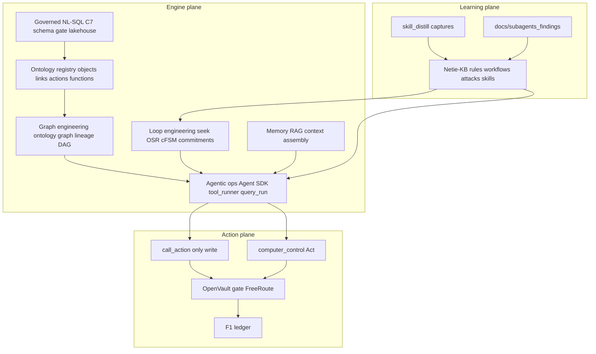

# Netie Engine Depth Plan — foundation through Palantir-grade ontology + Act

**Status:** owner-directed master plan · **Date:** 2026-07-31 · **Audience:** Claude Code (primary builder) + Cursor (UI/demo lane)  
**North star:** [`CORTEX_FINAL_GOAL.md`](CORTEX_FINAL_GOAL.md) — Cortex is the best *engine*, not another app.  
**Parent maps:** [`docs/ACTIVE.md`](../ACTIVE.md) · [`docs/dms/ACTIVE.md`](../dms/ACTIVE.md) · [`PARKING_LOT.md`](../../PARKING_LOT.md)  
**DMS-first order (binding):** [`docs/dms/DMS_ANCHORED_SEQUENCE.md`](../dms/DMS_ANCHORED_SEQUENCE.md) — finish C/T remainders + Postgres/Amend/Spaces + claim_n **before** running H0–H6 as a program. Pull individual H slices forward only when they directly improve live DMS.

**Companion research:** [`docs/ontology/CORTEX_ONTOLOGY_PLAN.md`](../ontology/CORTEX_ONTOLOGY_PLAN.md) · [`PALANTIR_AIP_RESEARCH.md`](../ontology/PALANTIR_AIP_RESEARCH.md)  
**Learning loops:** `D:\Netie-KB` · `skill_distill/DISTILL.md` · `docs/subagents_findings/`

---

## 0. Tone — what "strongest engine" means here

We are not building a Palantir clone, a Snowflake clone, or a Databricks clone.
We are building the **governed reasoning + action runtime** those products imply when
you strip away the UI chrome:

| Industry pattern | Netie engine equivalent (what we own) | Consumer surface (what we do *not* swallow) |
|------------------|----------------------------------------|-----------------------------------------------|
| Palantir Ontology + AIP | Object/link/action/function registry; `call_action` only write path; Agent SDK; lineage + ledger | AIP Studio UI → DMS / AirGPT / pack UIs |
| Snowflake / Databricks | Lakehouse + semantic metrics + governed NL→SQL + Spaces ACL | Full warehouse SaaS console → DMS |
| Click / Act / RPA | `computer_control` + fail-closed Act + OpenVault gate | Pointer / Netie Clicks product |
| Claude Code / Cursor agentics | Distill → KB workflows/skills → DAG/OSR/seek loops | The IDEs themselves |

**Litmus (unchanged):** *Does this make the engine better, or is it just another app?*  
If app → `D:\DMS` / `D:\Netie Clicks` / pack. If engine → `CortexOS/` + Protocols + contract.

**Honesty (unchanged):** Never claim MemPalace/Mem0/trained JEPA, full Palantir parity,
or "0 wrong" below N=310. Patterns in O1–O7 and this plan are the path; shipping claims
require evidence gates.

**Owner decision recorded by this document:** deepen ontology + agentic + Distill/KB
*toward* Palantir-grade foundation **now**, without waiting for a paying client to unlock
P1 *research and internal depth*. Customer-facing "AIP Studio parity" marketing remains
gated (P1 condition). Build the spine; do not lie about the product surface.

---

## 1. Foundation already poured (do not rebuild)

| Layer | Shipped / green | Implication |
|-------|-----------------|-------------|
| Governance | F1 ledger, F5 gate, F7 RBAC, hostile SQL corpus | Every new capability must hang off these |
| Contract | `cortex-contract` 1.2.0, ask + drillthrough | Additive minors only for clarify/agent fields |
| Answer plane | L0/L1 metrics, C7 Protocol port, exclusion clarify, envelope E1–E8 | Customer artifact assertions forever |
| Eval | Corpus expanded 376, claim_n 47, Trust honest | Floor before agentic autonomy marketing |
| Ontology (O1–O7 patterns) | Objects/links/actions/functions YAML + Agent SDK + sidecar | Refresh + unify — do not fork a second ontology |
| Agentic spine | Seek/OSR/routines/commitments G2; tool_runner; C5 ToolClass; C8 query_run | Loop/graph engineering extends these |
| Act | `computer_control` + Pointer | Revolutionary Click = deepen Act + ontology actions |
| Learning | Netie-KB R/W/A/F + skill_distill captures | Must be *consumed* every session, not decorative |
| DMS demo clear | Drillthrough fix, exclusion chip, live stack | Keep demo green while engine deepens |

---

## 2. Architecture of depth (four engineering disciplines)



### 2.1 Loop engineering

Reusable closed loops with **Model tier** per step (from KB W-0001 pattern):

| Loop | Trigger | Shape | Engine home |
|------|---------|-------|-------------|
| Adversarial review | Security change | N adversaries → verifier → judge | Already W-0001 |
| Seek → outcome → value | Bound goal | Propose → user/agent outcome → JEPA family gate | G2 shipped; deepen |
| Ask → clarify → confirm → answer | Ambiguous exclude/entity | Confirm chip → continue token | Exclusion clarify (shipped); generalize |
| Propose → confirm → apply → receipt | Amend / mutation | Soft gate → F5 → ledger | DMS W2; engine `call_action` |
| Distill → promote → skill | Capture exists | Unverified finding → verified → W/R/A → S | P19 + KB promote |
| Ingest → bronze → silver → sync → ask | Studio | Pipeline + warehouse sync | Lakehouse; Spaces ACL later |

**Rule:** every new loop files a `W-####` with Trigger / Shape / Rationale / Model tier / Anti-patterns.

### 2.2 Graph engineering

| Graph | Nodes | Edges | Used by |
|-------|-------|-------|---------|
| Ontology graph | object_types, properties | link_types | Agent grounding, Library Data Map, query planning |
| Lineage graph | sources, pipelines, metrics | produced_by / reads | T7 drillthrough, Amend, Trust |
| Action graph | action_types, tools, roles | requires / produces | C5 ToolClass, F5 |
| DAG / routine graph | nodes, presets | next / race | Orchestration |
| Eval graph | seeds, paraphrases, attacks | covers / found | Corpus growth |

**Palantir-grade bar (internal):** one registry, one compile path, queryable by agents,
human-readable descriptions, `agent_visible` on properties, actions are the only write,
lineage joinable to ledger events. Full Foundry UX is *not* the bar for this repo.

### 2.3 Agentic operations

| Capability | Now | Depth target |
|------------|-----|--------------|
| Agent SDK `call_action` / `query_objects` | Shipped | Every pack action registered; no raw SQL write from agents |
| ToolClass read/propose/apply | C5-min | Propose-default for agents; apply only with confirm + human or break-glass |
| Durable `query_run` | C8-min | Plausibility (C10) + agent run history UI via DMS Runs |
| Multi-agent | Distill captures | Orchestrator-centric (not planner/coder/tester swarms); W-0001 shape |
| Memory | Partial RAG | Hybrid retrieval + ontology-as-memory; JEPA family honest scaffold |
| Act / Click | Pointer shipped | Ontology actions that *invoke* Act with OV gate — enterprise "do the thing" |

### 2.4 Distill + KB as living engine fuel

**Every Claude Code session (non-negotiable):**

1. `python D:\Netie-KB\scripts\kb.py search "<keywords>"` → 3-line report  
2. Read `skill_distill/DISTILL.md` + relevant `learned/*.md`  
3. Preflight `docs/subagents_findings/INDEX.md`  
4. End: `kb.py new finding` + promote when verified; distill capture if new product insight  

**Horizon work:** KB skills (`S-####`) become invokable engine skills; workflows become
DAG/routine templates; attacks become corpus cases (monotonic).

---

## 3. Horizon map (careful sequencing)

Do not parallelize everything. Each horizon has an exit gate.

### Horizon 0 — Freeze the demo floor (1–2 days) — EXIT: live green + committed when asked

Already largely done 2026-07-31 evening. Close-out only:

- Commit path lists (owner ask) for Cortex demo fixes + C5/C8 + samples  
- Land DMS worktree predictive + drillthrough gate into `D:\DMS`  
- `verify_gold --review` wave 1 (claim_n toward 100+)  
- Stack script: pinned OV + `DMS_READ_ONLY_QUERIES=1` documented in handoff  

### Horizon 1 — Ontology refresh to "one spine" (1–2 weeks) — EXIT: agent can only act via ontology

**Goal:** Palantir-*shaped* foundation inside Cortex (not AIP Studio UI).

| Wave | Task | Done when |
|------|------|-----------|
| H1.1 | Ontology audit: objects/links/actions/functions vs semantic_layer vs metrics vs ledger event strings | Diff report; no silent drift |
| H1.2 | Refresh DMS ontology YAML to cover every warehouse table + metric `reads:` + every ledger event | Compile green; `/dms/ontology` counts rise honestly |
| H1.3 | Property-level `agent_visible` + sensitive flags single source | Sensitive columns cannot drift |
| H1.4 | Action registry completeness: every mutate path is an action_type with ToolClass | AST/invariant: no ungoverned write helper |
| H1.5 | Lineage fields on metrics + pipelines joinable to T7 provenance | Drillthrough approximate only when columns absent |
| H1.6 | Ontology graph API (read): nodes/edges for Library Data Map | Contract minor if needed |
| H1.7 | Agent SDK hard gate: refuse tools not in ontology registry | Tests red→green |

**Parked until later:** Foundry Workshop/AIP Studio UI, multi-tenant ontology marketplace (P1 full).

### Horizon 2 — DB engine supremacy for DMS (2–3 weeks) — EXIT: C7 product + Spaces ACL path

| Wave | Task | Done when |
|------|------|-----------|
| H2.1 | C7 schema-gate product hardening (Prompt I) | Paraphrase robustness ↑; wrong=0; envelope asserts |
| H2.2 | Generalize exclusion-clarify → entity-clarify loop | Locations, suppliers, statuses |
| H2.3 | Postgres Phase0 host topology (compose publish or Caddy-only documented path) | DMS `database_configured: true` on demo host |
| H2.4 | Amend Proposal loop (engine actions + DMS UX) | Confirm token → apply → receipt |
| H2.5 | Spaces persist + enforce (data-plane ∩ sources) | In-memory stub retired |
| H2.6 | claim_n → 310 | Trust may show supported only then |
| H2.7 | BIRD three-bucket adapter (after Spaces) | Abstain ≠ incorrect |
| H2.8 | Lakehouse ↔ ontology sync (bronze/silver described in graph) | Studio + ontology agree |

**Snowflake/Databricks foundation (engine meaning):**

- Time-travel / versioned tables where lakehouse already supports  
- Governed semantic layer (metrics) as the "warehouse semantic view"  
- Spaces as the "secure share / row ACL" analogue — not a Unity Catalog clone  

### Horizon 3 — Agentic + loop/graph OS (2–4 weeks) — EXIT: proactive seek on bound goals

| Wave | Task | Done when |
|------|------|-----------|
| H3.1 | Ingest all `skill_distill/captures` → KB findings (unverified) + promote batch | MINING_REPORT + ≥15 findings |
| H3.2 | Promote 5+ workflows (clarify loop, amend loop, Act loop, distill loop, corpus-harden) | W-0005+ |
| H3.3 | Skills pack: `subagent-preflight`, `exclusion-clarify`, `adversarial-review` as S-#### | `kb.py` + `.claude/skills` sync |
| H3.4 | Wire KB workflows into routine/OSR suggestions | Seek proposes W-shaped plans |
| H3.5 | Multi-pool memory broker (P22 remainder) — design then min | Spec + one durable store |
| H3.6 | Context assembly v2: ontology slice + retrieval + ledger snippets | Token budget + provenance |
| H3.7 | Proactive seek litmus on DMS bound goal (silence → still advances safely) | G2.5+ evidence |

### Horizon 4 — Click / Act revolution (parallel after H1.4) — EXIT: ontology action → desktop Act

| Wave | Task | Done when |
|------|------|-----------|
| H4.1 | Map enterprise "clicks" to action_types (export, open Excel, fill form, approve) | YAML + OV gate |
| H4.2 | `call_action` → `computer_control` bridge with session bind | Fail-closed; ledger event |
| H4.3 | DMS "After answer → Act" suggestions (download CSV already; add Act chips) | Customer envelope |
| H4.4 | Demo script: ask → clarify → answer → Act on Excel/browser | Recorded smoke |
| H4.5 | Red-team Act (W-0001): no silent desktop without OV | Corpus cases |

Pointer stays a **peer consumer**. DMS demo may *invoke* Act; it does not own Act.

### Horizon 5 — Engine product surface (P17/P18) — EXIT: external builder can adopt without source

| Wave | Task | Done when |
|------|------|-----------|
| H5.1 | Hosted API surface catalog (orchestration, ontology, ask, Act, memory) | OpenAPI + docs |
| H5.2 | Self-host "netie engine" packaging checklist | One command smoke |
| H5.3 | Whitepaper already exists — architecture booklet from O2 map | P18 remainder |
| H5.4 | OpenVault P17a → G2.6 when vault lane clean | Offline verify |

### Horizon 6 — Palantir AIP *depth* (parked product claim; build patterns) — EXIT: condition review

Only after H1–H3 green and explicit STATUS gate:

- Agent Studio patterns (build agents from ontology actions)  
- Workshop-like object explorers in DMS Library (consumer UI)  
- Cross-object actions with parameter schemas + side-effect declarations  
- Full lineage UI  

**Still not:** "We are Palantir." Evidence + paying use-case before P1 unpark for *marketing*.

---

## 4. What Claude Code must ingest before each deep wave

```text
1) python D:\Netie-KB\scripts\kb.py search "<wave keywords>"
2) Read skill_distill/DISTILL.md + learned/INDEX.md
3) Read docs/subagents_findings/INDEX.md → PREFLIGHT HIT|PARTIAL|MISS
4) Read this file §3 for the active Horizon wave exit gate
5) Read docs/dms/ACTIVE.md if DMS/Spaces touched
6) Never CortexOS → packs.*; never weaken manifest; never git add -A
```

**Distill backlog to mine first (H3.1):**

- `2026-07-27_anthropic_multi-agent-*.md` → W-0001 variants  
- `2026-07-27_cursor_rag-*.md` → memory/retrieval skills  
- `2026-07-25_claude-code_all-lanes.md` → orchestration Model tier  
- `2026-07-29_dms-spaces_chatgpt-for-excel.md` → Spaces product law  
- `2026-07-29_cortex-honesty_dms-friday.md` → honesty invariants  

---

## 5. Anti-scope (will destroy the engine if ignored)

- Second engine repo / Brain B forever fork  
- Excel bidirectional write-back  
- Weakening manifest refusals or hostile-SQL reclassification  
- Claiming AIP/Palantir parity in UI copy before P1 gate  
- CRAG as north star; BIRD before Spaces  
- Planner/coder/tester swarms as default (Anthropic anti-pattern)  
- Hand-edited OpenAPI / generated CLAUDE.md  
- JEPA/MemPalace as "shipped"  
- Building RUMA/Closer into engine core  

---

## 6. Success scoreboard (engine strength)

| Metric | Floor | Target |
|--------|-------|--------|
| Corpus claim_n / wrong | 47 / 0 | ≥310 / 0 |
| Ontology: every warehouse table + action covered | Partial | 100% |
| Agent writes outside `call_action` | Must be 0 | 0 |
| KB workflows with Model tier | 4 | ≥12 |
| Distill captures promoted to KB | Low | All 2026-07 captures triaged |
| Live drillthrough + clarify demo | Green | Stay green |
| Proactive seek silence litmus | Partial | Pass on one bound DMS goal |
| Act via ontology + OV | Partial | One end-to-end enterprise click |

---

## 7. Document control

| Doc | Role |
|-----|------|
| **This file** | Master depth plan — horizons + tone |
| [`CLAUDE_CODE_ENGINE_DEPTH_PACKET.md`](../dms/packets/CLAUDE_CODE_ENGINE_DEPTH_PACKET.md) | Pasteable long tasks for Claude Code |
| [`CLAUDE_CODE_HANDOFF_NEXT.md`](../dms/packets/CLAUDE_CODE_HANDOFF_NEXT.md) | DMS demo / eval near-term |
| `D:\Netie-KB` | Binding invariants + workflows |
| `skill_distill/DISTILL.md` | How we learn from other agents |

Update STATUS.md one-liner when a Horizon exits. Do not mid-sprint unpark P1 marketing without owner STATUS edit.
