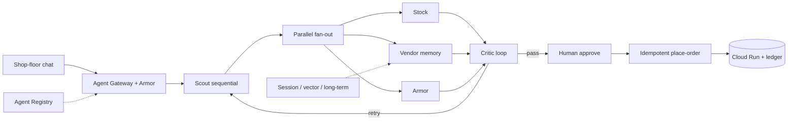

# Night Shift

SME factory purchasing agent fleet. A messy shop-floor chat becomes **one** purchase order. Crash the process mid-send. Resume. It must not order twice.

Built for the Google All Things Agentic Hackathon (Aug 2026). Track: **Fortified Enterprise Fleet**. Unlikely hero: a night-shift purchasing clerk at a small factory, not a Fortune-500 IT team.

## Mandatory stack

| Requirement | What we use |
|---|---|
| Gemini 3.5+ | `gemini-3.5-flash` via Gemini API / Vertex AI |
| Google agent framework | Google ADK 2 `Workflow` graph |
| Google Cloud service | Cloud Run (Firestore optional for Memory Bank) |

Pre-existing code disclosed: Cortex (`D:\Cortex` engine -- ledger, routines, OSR) is optional. This repo is new work from 23 Aug 2026. Night Shift does not import `CortexOS`.

## GET HELP mapping (do not skip)

See `GET_HELP.md`. The four official webinars are implemented as working code, not slides:

1. Three ADK 2 patterns -- sequential, parallel fan-out, critic loop
2. Long-running -- crash, human approval, **idempotent place-order** (the two-laptops trap)
3. Self-evolving -- prompt rewrite + gaming detector
4. Memory hierarchy -- session, vector search, long-term bank

## Spin-up (local)

```bash
cd night_shift
python -m venv .venv
.venv\Scripts\activate
pip install -e ".[dev]"
pytest
set GEMINI_API_KEY=your_key
uvicorn night_shift.server:api --port 8080
```

Open http://127.0.0.1:8080

Demo clicks, in order:

1. Start sequential + parallel + critic loop
2. Human approve
3. Crash before commit
4. Resume -- ledger `placed_count` stays 1, status `idempotent_replay`

ADK web (needs the key):

```bash
adk web night_shift
```

## Spin-up (Cloud Run)

Proof for the 4-minute video: Cloud Run dashboard or a `*.run.app` URL in the address bar.

```bash
gcloud init
gcloud run deploy night-shift --source . --region asia-southeast1 --allow-unauthenticated --set-env-vars GEMINI_API_KEY=your_key,GOOGLE_CLOUD_PROJECT=your_project --min-instances 0 --max-instances 2
```

Then turn it off after you record. Scale-to-zero is the cost control from the Resources tab.

Request $150 credits before 28 Aug 12:00 PT: https://forms.gle/riGhgDSHkHeMx8Ca6
Track to write on the form: Fortified Enterprise Fleet
One-liner: Night Shift is an SME factory agent fleet that finishes a purchase order once, even after a crash.

## Architecture



## What is in this repo vs Cortex

| This repo (new, contest period) | Cortex (pre-existing, disclosed) |
|---|---|
| ADK 2 Workflow, Gemini 3.5, Cloud Run | Governed engine, OSR, routines, ontology |
| Idempotent PO ledger | F1 hash-chain ledger |
| Memory hierarchy demo | RawKnn / context engineering |
| Crew specialties (Scout/Critic/Placer) | Worktree crew UI, not imported |

## Tests

```bash
pytest
```

The test that must not be deleted: `test_resume_does_not_order_twice`. That is the Aug 13 webinar.

## License

Apache-2.0 for this hackathon entry.
